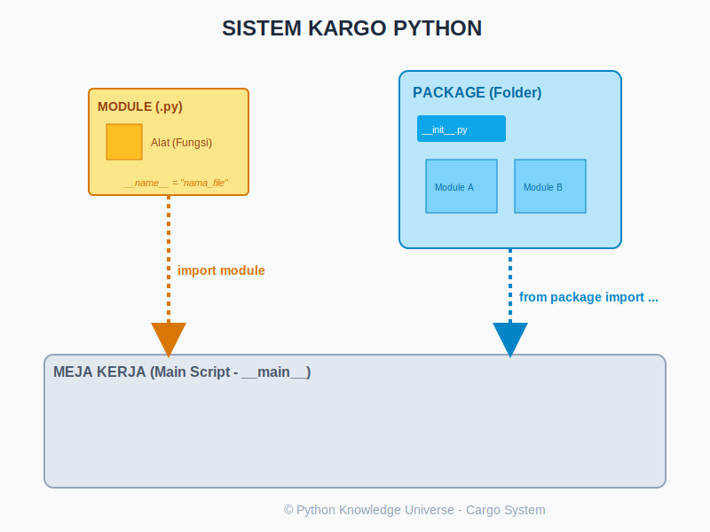

# Bab 05: Modules and Import

Chapter Code: CORE-02-05
Version: Core.Fundamentals.02.00
Last Updated: 2026-03-14
Status: Draft

> **Deskripsi Singkat**: Bab ini membahas cara memecah kode program raksasa menjadi potongan-potongan file kecil (Module) dan folder terorganisir (Package) agar kode mudah dikelola, dibagikan, dan digunakan kembali.

## 1. Analogi (Pendekatan Konsep)

### Analogi Singkat
> "Module adalah sebuah **Laci Berkas** spesifik, sementara Package adalah **Lemari Berkas** yang berisi banyak laci. Anda tidak perlu membawa seluruh lemari ke meja kerja; cukup ambil (import) laci yang Anda butuhkan saja."

### Analogi Panjang / Cerita (Ekspedisi Logistik Kargo)
Bayangkan Anda sedang mengelola sebuah pusat distribusi barang berskala besar. Anda tidak mungkin menaruh jutaan barang di satu meja kerja yang sama karena akan sangat berantakan dan sulit dicari.

- **Module (`.py` file) - Kotak Paket**: Setiap file Python yang Anda buat adalah satu kotak paket. Di dalamnya terdapat alat-alat khusus (Fungsi, Variabel, atau Class).
- **`import` (Pemesanan Barang)**: Jika meja kerja Anda butuh obeng, Anda "memesan" kotak paket tersebut. Instruksi `import alat_tukang` berarti Anda mendatangkan kotak bernama `alat_tukang` ke meja Anda. Untuk memakainya: `alat_tukang.obeng()`.
- **`from ... import` (Kurir Ekspres)**: Anda tidak butuh seluruh isi kotak paket karena terlalu berat. Anda hanya meminta kurir membawakan **satu buah kunci inggris** saja dari kotak `alat_tukang`. Dengan `from alat_tukang import kunci_inggris`, barang tersebut langsung ada di meja Anda tanpa perlu menyebut nama kotaknya lagi.
- **Package (Kontainer Kargo)**: Adalah folder yang mengelompokkan banyak kotak paket (Module). Syarat sah sebuah folder dianggap Kontainer Kargo resmi (Package) di Python adalah adanya file manifes ghaib bernama `__init__.py`.
- **`__name__` (Kartu Identitas)**: Setiap kotak paket punya stiker nama ghaib. Jika kotak tersebut sedang dikirim ke meja orang lain, stikernya bertuliskan nama asli file-nya. Tapi, jika Anda sedang berada di dalam gudang asal dan membuka kotak tersebut langsung, stikernya berubah menjadi simbol rahasia: `"__main__"`. Ini berguna untuk mengetes isi kotak tanpa mengganggu orang yang memesannya.

## 2. Istilah Kunci (Key Terms)

| Istilah | Definisi Singkat | Contoh |
|---|---|---|
| Module | File tunggal berakhiran `.py` yang berisi kode Python | `matematika.py` |
| Package | Direktori (folder) yang berisi setidaknya satu file `__init__.py` dan beberapa module | Folder `database/` |
| Namespace | Wilayah kekuasaan nama variabel agar tidak bentrok dengan file lain | `module_a.data` vs `module_b.data` |
| Alias | Nama samaran singkat untuk modul yang namanya terlalu panjang | `import pandas as pd` |
| Standard Library | Koleksi modul bawaan yang sudah terpasang otomatis saat Anda install Python | `math`, `sys`, `os` |

## 3. Konsep Utama

### A. Tiga Cara Melakukan Impor
Python sangat fleksibel dalam cara Anda mendatangkan modul:
1. **`import resep`**: Mengambil seluruh modul. Akses isi dengan tanda titik (`resep.potong()`).
2. **`from resep import potong`**: Mengambil fungsi spesifik. Bisa langsung dipanggil `potong()`.
3. **`import resep as rs`**: Memberi nama panggilan agar tidak capek mengetik nama yang panjang.

### B. Membuat Package (Folder Proyek)
Jika proyek Anda semakin besar, pecahlah menjadi folder. Pastikan ada file kosong bernama `__init__.py` di dalamnya agar Python mengenalnya sebagai kumpulan modul terpadu.

### C. Standard Library: "Battery Included"
Python terkenal dengan filosofi *"Battery Included"*, artinya ia sudah membekali Anda dengan ribuan alat gratis di dalam "Gudang Pusat" miliknya.
- `math`: Untuk kalkulasi tingkat dewa (sin, cos, pi).
- `random`: Untuk kebutuhan dadu/angka acak.
- `datetime`: Untuk urusan waktu dan tanggal.

### D. Pelindung `__name__ == "__main__"`
Gunakan pelindung ini di akhir modul Anda agar kode tes/percobaan tidak ikut berjalan saat orang lain mengimpor modul Anda.

```python
if __name__ == "__main__":
    print("Kode ini hanya jalan jika file ini dibuka langsung!")
```

## 4. Visualisasi Analogi



## 5. Di Balik Layar (Under the Hood)
Pernahkah Anda bingung kenapa Python bisa menemukan modul `math` tapi tidak bisa menemukan file `.py` yang baru saja Anda buat? Python mencari file berdasarkan daftar alamat rahasia yang disebut **`sys.path`**. Urutannya adalah:
1. Folder tempat skrip utama dijalankan.
2. Variabel lingkungan `PYTHONPATH`.
3. Folder instalasi Standard Library.
Jika di semua alamat itu file Anda tidak ditemukan, Python akan melontarkan pesan `ModuleNotFoundError`.

## 6. Peringatan / Jebakan Umum (Gotchas)
- **Nama File yang "Sama"**: Jangan pernah menamai file Anda `random.py` atau `math.py`. Jika Anda melakukan `import random`, Python akan bingung dan mungkin malah mengimpor file Anda sendiri alih-alih modul bawaan, menyebabkan error massal.
- **Circular Imports**: Kejadian di mana Modul A mengimpor Modul B, dan Modul B juga mengimpor Modul A. Ini adalah "Cinta Segitiga" yang mematikan bagi Python.
- **Wildcard Import (`from ... import *`)**: Cara malas yang berbahaya karena akan memasukkan jutaan nama asing ke kode Anda dan mungkin menindih nama variabel yang sudah Anda buat sebelumnya.

## 7. Referensi Kode Praktik
Simulasi pengiriman kargo tersedia di folder `examples/`:
- `toko_alat.py`: Sebuah modul penyedia fungsi (Kotak Paket).
- `01_pembeli_import.py`: Demonstrasi mengimpor dan memesan barang dari `toko_alat`.
- `paket_kurir/`: Contoh struktur Package (Kontainer).
- `02_uji_identitas.py`: Membuktikan kekuatan rahasia `__name__`.

## 8. Latihan (Validasi)
- [ ] Buatlah file bernama `kalkulator.py` berisi fungsi tambah dan kurang, lalu impor ke file baru bernama `main.py`.
- [ ] Gunakan modul bawaan `random` untuk memilih satu nama secara acak dari sebuah list teman Anda.
- [ ] Cobalah hapus file `__init__.py` di dalam sebuah folder modul, lalu coba impor sub-modulnya. Lihat apakah Python masih mengenalinya.
