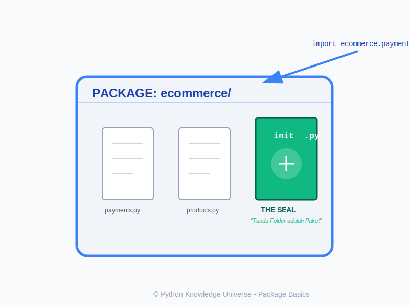

# Bab 06: Package Basics

Chapter Code: CORE-02-06
Version: Core.Fundamentals.02.00
Last Updated: 2026-03-14
Status: Draft

> **Deskripsi Singkat**: Mempelajari cara mengelompokkan banyak modul ke dalam struktur folder yang rapi menggunakan mekanisme *Package* dan file `__init__.py`.

## 1. Analogi (Pendekatan Konsep)

### Analogi Singkat
> "Modul itu seperti **buku tunggal**, sedangkan *Package* adalah **kotak set buku** yang berisi banyak buku bertema sama. File `__init__.py` adalah **segel resmi** yang menandakan bahwa kotak tersebut adalah satu kesatuan paket, bukan sekadar folder biasa."

### Analogi Panjang / Cerita (Namespace)
Bayangkan Anda memiliki banyak **Resep Masakan** (Modul `.py`).
- Awalnya semua kertas resep ditaruh di atas meja. Lama-lama meja berantakan.
- Anda mulai memasukkan resep kue ke dalam **Map Biru** dan resep daging ke dalam **Map Merah**.
- Di Python, Map (Folder) ini disebut **Package**.
- Agar Python tahu bahwa folder tersebut berisi kode (bukan sekadar folder foto), kita menaruh kertas kosong berjudul `__init__.py` di dalamnya.
- Sekarang, untuk memanggil resep kue bolu, Anda tidak hanya memanggil "Bolu", tapi "**MapBiru.Bolu**". Ini mencegah bentrok jika di Map Merah ada resep "Bolu Daging".

## 2. Istilah Kunci (Key Terms)

| Istilah | Definisi Singkat | Contoh |
|---|---|---|
| Package | Folder yang berisi satu atau lebih modul Python dan file `__init__.py`. | Folder `ecommerce/` |
| Module | File tunggal berekstensi `.py` yang berisi kode Python. | `utils.py` |
| `__init__.py` | File khusus yang memberi tahu Python bahwa folder tersebut adalah sebuah paket. | `__init__.py` |
| Namespace | Ruang lingkup nama yang mencegah konflik penamaan antar modul. | `math.sqrt` vs `mymodule.sqrt` |
| Sub-package | Paket yang berada di dalam paket lain. | `ecommerce.payments` |

## 3. Konsep Utama

### Struktur Package
Struktur folder minimal sebuah paket:
```text
my_project/
├── main.py
└── my_package/
    ├── __init__.py
    ├── module_a.py
    └── module_b.py
```

### Cara Import dari Package
1. **Import Modul**: `import my_package.module_a`
2. **Import Fungsi**: `from my_package.module_a import my_function`
3. **Alias**: `import my_package.module_a as mod_a`

### Peran `__init__.py`
- Menandai folder sebagai paket.
- Bisa digunakan untuk mengekspos fungsi tertentu agar lebih mudah diakses (misal: `from my_package import fast_func` alih-alih `from my_package.internal.deep.module import fast_func`).

## 4. Visualisasi Analogi



## 5. Peringatan / Jebakan Umum (Gotchas)
- **Hindari ini**: Membuat struktur folder yang sangat dalam (*deeply nested*) tanpa alasan kuat. Ini membuat import menjadi sangat panjang dan sulit dibaca.
- **Ingat bahwa**: Sejak Python 3.3, `__init__.py` secara teknis tidak wajib (disebut *Namespace Packages*), namun sangat disarankan untuk tetap digunakan agar eksplisit dan kompatibel.

## 5. Referensi Kode Praktik
Silakan lihat skrip lengkapnya pada direktori `examples/` di dalam bab ini. Di sana terdapat struktur paket mini yang bisa Anda jalankan.

```python
# Contoh memanggil paket
from my_package import module_a
module_a.say_hello()
```
