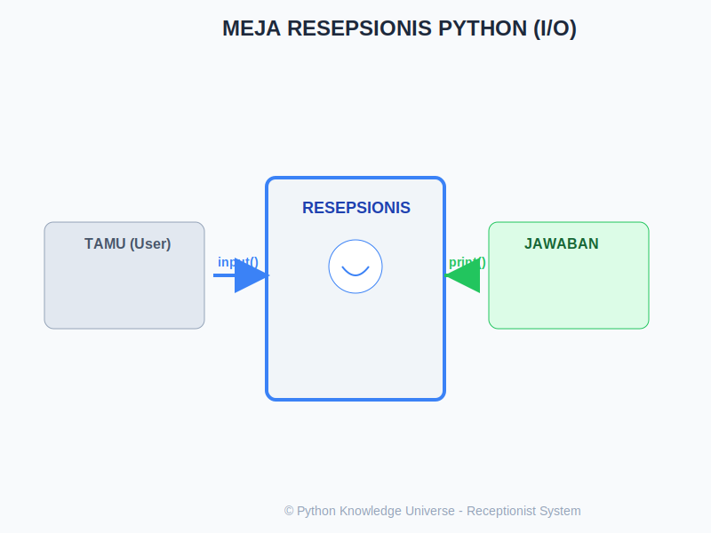

# Bab 07: Input & Output (I/O) Dasar

Chapter Code: CORE-02-07
Version: Core.Fundamentals.02.00
Last Updated: 2026-03-14
Status: Draft

> **Deskripsi Singkat**: Bab ini membahas cara dasar program Anda berkomunikasi dengan manusia di depannya. Kita akan belajar cara bertanya menggunakan `input()` dan menjawab menggunakan `print()`.

## 1. Analogi (Pendekatan Konsep)

### Analogi Singkat
> "Input/Output adalah **Meja Resepsionis** sebuah perusahaan. `input()` adalah saat resepsionis mendengarkan pertanyaan/data dari tamu (user), sementara `print()` adalah saat resepsionis memberikan jawaban atau informasi ke tamu."

### Analogi Panjang / Cerita (Layanan Pelanggan / Customer Service)
Bayangkan Anda sedang berbicara dengan seorang Petugas Layanan Pelanggan (Program Anda).

- **`input()` (Mendengarkan Tamu)**: Petugas bertanya: "Atas nama siapa?". Petugas akan terdiam (program berhenti sejenak) sampai tamu menjawab. Jawaban tamu akan diterima sebagai string (teks), karena petugas menganggap segala sesuatu yang diucapkan adalah "kata-kata".
- **Parsing (Penerjemahan Bahasa)**: Jika tamu menyebutkan angka "25", petugas tetap mencatatnya di kertas sebagai teks `"25"`. Jika petugas ingin melakukan perhitungan matematika, ia harus menerjemahkannya dulu menjadi angka asli (`int` atau `float`) menggunakan alat penerjemah.
- **`print()` (Menjawab Tamu)**: Setelah petugas punya informasi, ia akan membacakan hasilnya kembali ke tamu. Petugas bisa merangkai kata-kata yang rapi menggunakan "F-String" agar tamu senang.
- **Validasi (Cek KTP)**: Sebelum memproses jawaban tamu, petugas akan mengecek: "Apakah jawabannya masuk akal?". Jika tamu ditanya umur dan menjawab "Pisang", petugas harus menolak dengan sopan.

## 2. Istilah Kunci (Key Terms)

| Istilah | Definisi Singkat | Contoh |
|---|---|---|
| Prompt | Pesan instruksi sebelum user mengetik sesuatu | `"Siapa namamu?"` |
| Standard Input | Aliran data masuk (biasanya keyboard) | `input()` |
| Standard Output | Aliran data keluar (biasanya layar monitor) | `print()` |
| F-String | Cara paling modern dan rapi untuk menggabung variabel ke teks | `f"Halo {nama}"` |
| Separator | Karakter pemisah antar data saat print | `sep=" | "` |

## 3. Konsep Utama

### A. Fungsi `input()`: Selalu Mendapatkan String
Ingat! Apapun yang diketik user, Python akan menganggapnya sebagai `str`.
```python
nama = input("Siapa namamu? ")
print(f"Halo {nama}, selamat datang!")
```

### B. Mengubah Tipe Data (Casting)
Jika butuh angka, bungkuslah input tersebut:
```python
umur = int(input("Berapa umurmu? "))
print(f"Tahun depan kamu berumur {umur + 1}")
```

### C. Teknik `print()` yang Pro
Anda bisa mengatur bagaimana data ditampilkan:
```python
# Mengatur akhir kalimat (end)
print("Baris satu", end=" --- ")
print("Masih di baris satu!")

# Menggunakan separator (sep)
print("Apel", "Jeruk", "Mangga", sep=", ")
```

## 4. Visualisasi Analogi



## 5. Di Balik Layar (Under the Hood)
Saat `input()` dipanggil, Python benar-benar membekukan eksekusi skrip. Ia menunggu sinyal dari sistem operasi bahwa user telah menekan tombol "Enter". Begitu tombol tersebut ditekan, barulah Python mengambil data dari memori sementara (keyboard buffer), mengubahnya menjadi objek string, dan menyimpannya ke variabel Anda.

## 6. Peringatan / Jebakan Umum (Gotchas)
- **Input Kosong**: Jika user cuma tekan Enter tanpa ketik apapun, `input()` akan menghasilkan string kosong `""`. Program Anda bisa crash jika langsung mencoba merubah ini jadi angka.
- **Tipe Data Salah**: Mencoba `int("25.5")` akan error. Gunakan `float()` untuk angka berkoma.
- **Prompt yang Tidak Jelas**: Jangan gunakan `input()` tanpa pesan prompt, user akan bingung kenapa programnya mendadak "hang".

## 7. Referensi Kode Praktik
Contoh percakapan dengan program tersedia di folder `examples/`:
- `01_kenalan_input.py`: Dasar-dasar bertanya dan menjawab.
- `02_kasir_sederhana.py`: Latihan konversi harga dan jumlah.
- `03_variasi_print.py`: Teknik mempercantik tampilan output.

## 8. Latihan (Validasi)
- [ ] Buat program yang meminta input dua angka, lalu tampilkan hasil penjumlahannya. (Ingat casting!).
- [ ] Buat "Mad Libs" mini: Minta input kata benda, kata sifat, dan kata kerja, lalu susun menjadi kalimat lucu.
- [ ] Gunakan `sep` dan `end` untuk menciptakan tampilan menu makanan yang rapi.
