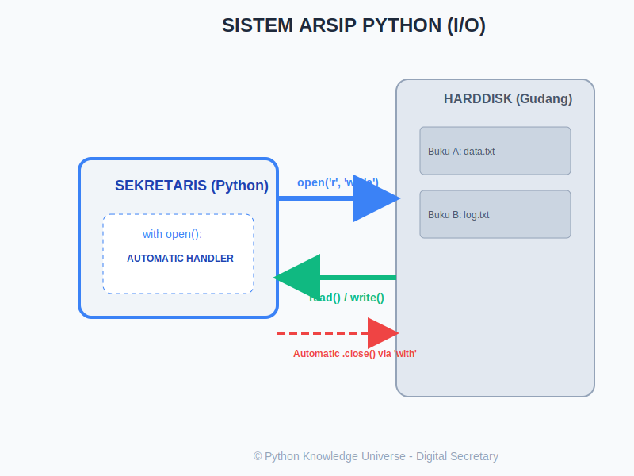

# Bab 08: File Handling

Chapter Code: CORE-02-08
Version: Core.Fundamentals.02.00
Last Updated: 2026-03-14
Status: Draft

> **Deskripsi Singkat**: Bab ini mengajarkan cara program Anda berinteraksi dengan dunia luar secara permanen dengan membaca isi file teks dan menuliskan data ke dalam harddisk.

## 1. Analogi (Pendekatan Konsep)

### Analogi Singkat
> "File I/O adalah cara Python mengakses **Lemari Arsip** permanen. Tanpa I/O, semua data Python Anda akan hilang saat komputer dimatikan. Anda harus membuka laci (`open`), melakukan pekerjaan (`read/write`), lalu yang terpenting: **menutup laci** tersebut (`close`)."

### Analogi Panjang / Cerita (Sekretaris Digital & Buku Laporan)
Bayangkan Anda memiliki seorang Sekretaris Digital (Interpreter Python) dan sekumpulan Buku Laporan (Files) di dalam gudang (Harddisk).

- **`open()` (Membuka Buku)**: Anda memanggil sekretaris Anda: "Tolong ambilkan buku 'laporan.txt'." Sekretaris akan mencari buku tersebut. Namun, Anda harus menentukan niat Anda melalui **Mode**:
    - `'r'` (Reading): "Saya hanya ingin membaca, tolong jangan bawa pulpen!"
    - `'w'` (Writing): "Tolong hapus seluruh isi buku lama, saya mau menulis laporan baru dari nol." (Hati-hati: isi lama akan musnah!).
    - `'a'` (Appending): "Jangan hapus isinya, cukup tambahkan tulisan saya di baris paling terakhir."
- **`read()` vs `write()`**: Ini adalah instruksi tugas saat buku sudah terbuka di atas meja.
- **`close()` (Mengembalikan ke Rak)**: Ini sangat krusial. Jika Anda tidak menyuruh sekretaris menutup dan mengembalikan buku, buku tersebut akan tetap di meja (memakan memori RAM) dan mungkin akan rusak atau tidak bisa dipinjam oleh program lain.
- **`with` statement (Asisten Pintar Otomatis)**: Python memiliki sistem asisten bernama `with`. Ia akan membukakan buku untuk Anda, menjaga buku tetap terbuka selama Anda bekerja di dalam ruangan (blok kode), dan **otomatis** mengembalikan buku ke rak begitu Anda melangkah keluar ruangan tersebut—bahkan jika tiba-tiba terjadi kesalahan teknis (Error).

## 2. Istilah Kunci (Key Terms)

| Istilah | Definisi Singkat | Contoh |
|---|---|---|
| File Handle | Objek perantara yang digunakan Python untuk mengontrol file yang terbuka | `f = open(...)` |
| Mode | Parameter yang menentukan apa yang boleh dilakukan terhadap file | `'r'`, `'w'`, `'a'` |
| Context Manager | Sistem `with` yang mengelola siklus hidup sumber daya (buka-tutup otomatis) | `with open(...) as f:` |
| Encoding | Cara komputer menerjemahkan karakter manusia menjadi angka biner | `utf-8` |
| Buffer | Tempat penyimpanan sementara sebelum data benar-benar ditulis ke disk | - |

## 3. Konsep Utama

### A. Membuka dan Menutup File
Cara manual (Tidak disarankan namun perlu tahu):
```python
f = open("catatan.txt", "w")
f.write("Halo Dunia")
f.close() # WAJIB
```

### B. Menggunakan `with` (Standard Industri)
Ini adalah cara yang aman. Anda tidak perlu memanggil `.close()` secara manual.
```python
with open("laporan.txt", "r") as f:
    konten = f.read()
    print(konten)
# Di sini file otomatis sudah ditutup
```

### C. Mode-mode Penting
- **`'r'` (Read)**: Error jika file tidak ada.
- **`'w'` (Write)**: Membuat file baru jika belum ada. Jika sudah ada, isinya ditimpa/dihapus.
- **`'a'` (Append)**: Menambah data tanpa menghapus isi lama.
- **`'x'` (Exclusive)**: Gagal jika file sudah ada (untuk keamanan).

### D. Membaca Baris demi Baris
Untuk file yang sangat besar, jangan gunakan `.read()` (karena akan memakan seluruh RAM). Gunakan perulangan:
```python
with open("data_besar.txt", "r") as f:
    for baris in f:
        print(baris.strip()) # strip() membuang enter tambahan
```

## 4. Visualisasi Analogi



## 5. Di Balik Layar (Under the Hood)
Saat Anda melakukan `.write()`, Python tidak langsung memutar piringan harddisk Anda. Ia menyimpannya dulu di sebuah area memori cepat bernama **Buffer**. Data baru benar-benar dipindahkan ke harddisk (Flushing) saat area buffer penuh atau saat fungsi `.close()` dipanggil. Itulah mengapa jika program Anda mati mendadak sebelum ditutup, data terakhir Anda seringkali hilang atau korup.

## 6. Peringatan / Jebakan Umum (Gotchas)
- **Terhapusnya Data Secara Tidak Sengaja**: Menggunakan mode `'w'` pada file yang sudah berisi data penting akan menghapus isinya secara permanen tanpa konfirmasi. Selalu gunakan `'a'` jika ingin menambah.
- **Encoding Errors**: Membuka file berisi emoji atau bahasa asing tanpa menentukan `encoding='utf-8'` di Windows seringkali menyebabkan error `UnicodeDecodeError`.
- **Lupa `close()`**: Pada program besar (seperti server), lupa menutup file bisa menyebabkan "Resource Leak" yang membuat server melambat atau crash karena kehabisan slot file sistem.

## 7. Referensi Kode Praktik
Simulasi kearsipan tersedia di folder `examples/`:
- `01_tulis_catatan.py`: Membuat file teks pertama Anda.
- `02_baca_arsip.py`: Mengintip isi folder kearsipan.
- `03_tambah_log.py`: Sistem pencatatan riwayat (Appending).
- `04_asisten_otomatis.py`: Kekuatan `with` dalam menjaga kerapihan.

## 8. Latihan (Validasi)
- [ ] Buatlah program yang menanyakan nama Anda, lalu simpan nama tersebut ke dalam file `pengguna.txt`.
- [ ] Buatlah file berisi 3 baris angka, lalu tulis program Python untuk membaca file tersebut dan menjumlahkan semua angkanya.
- [ ] Apa perbedaan hasil akhir antara menjalankan mode `'w'` dua kali dan mode `'a'` dua kali pada file yang sama? Cobalah!
