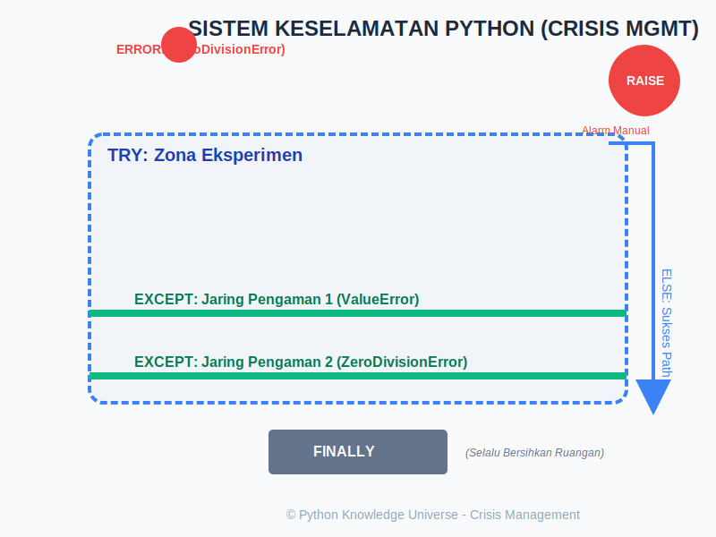

# Bab 09: Exception Handling

Chapter Code: CORE-02-09
Version: Core.Fundamentals.02.00
Last Updated: 2026-03-14
Status: Draft

> **Deskripsi Singkat**: Bab ini mengajarkan cara menangani situasi tak terduga (Error) agar program Anda tidak langsung crash/mati, melainkan bisa merespons dengan elegan melalui sistem jaring pengaman.

## 1. Analogi (Pendekatan Konsep)

### Analogi Singkat
> "Exception Handling adalah **Pakaian Pelindung** dan **Jaring Pengaman** bagi kode Anda. Ia tidak mencegah kecelakaan terjadi, tetapi ia memastikan bahwa saat kecelakaan terjadi, program Anda tidak 'mati' dan bisa memberikan laporan yang berguna."

### Analogi Panjang / Cerita (Sistem Manajemen Krisis Gedung)
Bayangkan eksekusi program Anda adalah aktivitas di dalam sebuah gedung perkantoran.

- **Exception (Alarm Kebakaran)**: Adalah tanda bahwa ada sesuatu yang salah. Misal, ada asap di pantry (Error: `FileNotFoundError`) atau ada korsleting listrik (Error: `ZeroDivisionError`). Jika tidak ada yang menangani alarm ini, seluruh gedung akan dievakuasi secara paksa (**Program Crash**).
- **`try` (Zona Eksperimen Berisiko)**: Anda memberi tahu Python: "Coba jalankan operasi ini di dalam ruangan berpelindung kaca. Saya tahu ini berisiko."
- **`except` (Tim Pemadam Kebakaran)**: Jika alarm di blok `try` berbunyi, tim ini akan langsung beraksi tanpa membubarkan seluruh gedung. "Jika asapnya dari pantry, lakukan prosedur A (Except FileNotFoundError). Jika dari listrik, lakukan prosedur B (Except ZeroDivisionError)."
- **`else` (Laporan Keamanan)**: Jika eksperimen di blok `try` berjalan mulus tanpa ada percikan api sedikit pun, jalankan selebrasi ini. Pesan: "Semua aman, lanjut ke fase berikutnya!"
- **`finally` (Protokol Pembersihan Wajib)**: Tidak peduli terjadi kebakaran atau gedung aman-aman saja, ruangan **WAJIB** dibersihkan dan lampu dimatikan. Sangat cocok untuk memastikan file ditutup atau koneksi internet diputus agar tidak boros sumber daya.
- **`raise` (Menekan Tombol Alarm Manual)**: Anda sendiri yang memutuskan: "Berdasarkan aturan bisnis saya, ini salah! (Misal: Saldo bank tidak boleh minus)". Tekan alarm secara manual untuk memancing respon darurat!

## 2. Istilah Kunci (Key Terms)

| Istilah | Definisi Singkat | Contoh |
|---|---|---|
| Exception | Objek yang mewakili sebuah error saat program berjalan | `ValueError`, `IndexError` |
| Catch | Menangkap error agar tidak menyebar dan mematikan program | Blok `except` |
| Traceback | Laporan sejarah "perjalanan" error dari mana ia berasal | Pesan merah di terminal |
| Propagation | Proses error yang "terbang" ke atas mencari siapa yang bisa menangkapnya | Bubbling up |
| Robust | Sifat kode yang tahan banting terhadap berbagai kesalahan | Kode yang banyak try-except-nya |

## 3. Konsep Utama

### A. Struktur Dasar `try-except`
Jangan tangkap "Semua Error" secara buta. Tangkaplah error yang memang Anda prediksikan mungkin terjadi.

```python
try:
    angka = int(input("Masukkan angka pembagi: "))
    hasil = 10 / angka
except ZeroDivisionError:
    print("Error: Tidak boleh membagi dengan nol!")
except ValueError:
    print("Error: Harap masukkan angka yang valid!")
```

### B. Kekuatan `finally`
Blok ini akan TETAP dijalankan meski program melakukan `return` atau menemui error yang tidak tertangkap. Ini adalah "Jaring Pengaman Terakhir".

### C. Mengapa Tidak Boleh `except:` Kosong?
Menyembunyikan semua error tanpa spesifikasi adalah dosa besar. Anda mungkin tidak sadar bahwa user sedang mencoba mematikan program (Ctrl+C), namun karena `except:` kosong menangkap segalanya, program tidak mau mati.

### D. Melempar Error Sendiri (`raise`)
Anda bisa menciptakan error sendiri jika ada logika bisnis yang dilanggar.
```python
usia = -5
if usia < 0:
    raise ValueError("Usia tidak mungkin negatif!")
```

## 4. Visualisasi Analogi



## 5. Di Balik Layar (Under the Hood)
Saat Python menemui baris yang bermasalah, ia menciptakan sebuah "Objek Exception". Jika baris tersebut tidak dibungkus dalam `try`, ia akan "melempar" objek itu ke fungsi yang memanggilnya. Jika di sana juga tidak ada `try`, ia terus dilempar ke atas hingga sampai ke interpreter utama. Jika sampai ujung tidak ada yang menangkap, barulah interpreter menyerah dan menampilkan **Traceback** merah yang kita benci.

## 6. Peringatan / Jebakan Umum (Gotchas)
- **Silencing Errors**: Menangkap error tapi tidak melakukan apa-apa (`pass`). Ini membuat bug sangat sulit dicari karena program terlihat "baik-baik saja" padahal datanya rusak di dalam.
- **Broad Except**: Menangkap `Exception` (kelas induk) padahal yang Anda ingin cegah hanya `IndexError`. Ini bisa menelan bug lain yang tidak sengaja Anda buat.
- **Try-Block Terlalu Besar**: Menaruh 50 baris kode di dalam satu blok `try`. Jika terjadi error, Anda akan kesulitan menebak baris mana yang sebenarnya bermasalah.

## 7. Referensi Kode Praktik
Laboratorium sistem keamanan tersedia di folder `examples/`:
- `01_pembagi_aman.py`: Menangani pembagian nol dan salah input.
- `02_pencarian_berkas.py`: Menangani `FileNotFoundError` dengan sopan.
- `03_pembersihan_paksa.py`: Menjamin penutupan sumber daya dengan `finally`.
- `04_alarm_kustom.py`: Cara menggunakan `raise` untuk validasi aturan bisnis.

## 8. Latihan (Validasi)
- [ ] Buat program yang meminta input list angka, lalu coba akses indeks yang tidak ada. Tangkap error-nya.
- [ ] Buat fungsi yang hanya menerima string. Jika dikasih angka, lempar (`raise`) sebuah `TypeError`.
- [ ] Buat sebuah blok `try-except-finally` dan perhatikan urutan print-nya saat error terjadi dan saat tidak terjadi.
