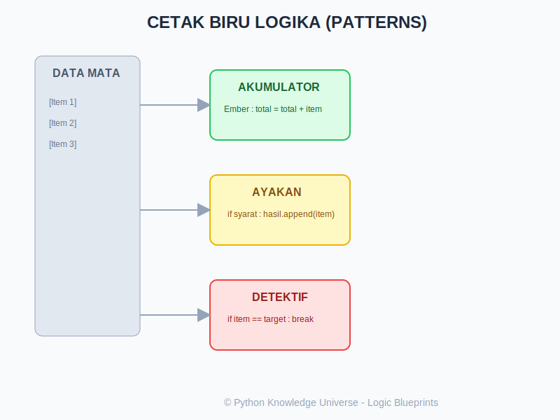

# Bab 10: Basic Programming Patterns (Pola Pemrograman Dasar)

Chapter Code: CORE-02-10
Version: Core.Fundamentals.02.00
Last Updated: 2026-03-14
Status: Draft

> **Deskripsi Singkat**: Bab ini adalah penutup dari buku Python Basics. Kita akan belajar cara merangkai semua bahan (if, for, list, functions) menjadi "Resep Logika" yang sering digunakan untuk menyelesaikan masalah nyata.

## 1. Analogi (Pendekatan Konsep)

### Analogi Singkat
> "Programming Patterns adalah **Buku Resep Rahasia**. Jika Bab 1-13 adalah bahan makanan (telur, garam, api), maka Patterns adalah resep cara membuat Omelet atau Nasi Goreng. Ini adalah cara standar menggabungkan bahan untuk hasil yang terbaik."

### Analogi Panjang / Cerita (Arsitek dan Cetak Biru)
Bayangkan Anda adalah seorang Arsitek yang sudah mahir memasang bata (variabel), menyemen dinding (loops), dan memasang atap (functions). Sekarang saatnya membangun sebuah rumah utuh.

- **Patterns (Blueprints/Cetak Biru)**: Alih-alih meraba-raba bagaimana cara membuat tangga, Anda mengikuti cetak biru yang sudah terbukti kokoh. Dalam coding, ini adalah "pola" yang selalu sama untuk masalah yang serupa.
- **Accumulator Pattern (Ember Penampung)**: Bayangkan ada air hujan dari genteng yang ingin Anda kumpulkan. Anda meletakkan ember kosong di bawah, dan setiap tetes air yang jatuh akan menambah isi ember sampai penuh.
- **Filter Pattern (Ayakan Pasir)**: Anda punya sekeranjang material campuran. Anda menuangkannya ke ayakan sehingga batu besar tertahan di atas dan pasir halus jatuh ke bawah. Anda hanya mengambil apa yang Anda butuhkan.
- **Search Pattern (Tugas Detektif)**: Anda menyisir setiap ruangan di gedung satu per satu. Begitu target ditemukan, Anda berhenti dan memberikan laporan.
- **Counter Pattern (Alat Klik Antrean)**: Setiap kali ada orang masuk, Anda menekan alat klik untuk menghitung total pengunjung.

## 2. Istilah Kunci (Key Terms)

| Istilah | Definisi Singkat | Contoh |
|---|---|---|
| Accumulator | Variabel untuk menampung hasil akumulasi (total/list) | `total = 0` |
| Sentinel Value | Nilai penanda untuk berhenti (seperti "Cukup!") | `input == "exit"` |
| Flag | Variabel bool untuk menandai status (Ketemu/Belum) | `found = False` |
| Filtering | Pola menyaring data berdasarkan syarat tertentu | `if x > 10` |
| Mapping | Pola mengubah setiap isi data menjadi bentuk lain | `x * 2` |

## 3. Konsep Utama

### A. Pola Akumulator (The Accumulator)
Digunakan untuk menjumlahkan atau mengumpulkan sesuatu ke dalam satu variabel.
```python
total = 0  # Inisialisasi 'Ember'
for angka in [10, 20, 30]:
    total += angka  # Isi 'Ember'
print(total) # 60
```

### B. Pola Penyaringan (Filtering)
Membuat daftar baru yang hanya berisi data "lolos seleksi".
```python
data = [1, 5, 12, 8, 20]
lolos = []
for x in data:
    if x > 10:  # Ayakan
        lolos.append(x)
print(lolos) # [12, 20]
```

### C. Pola Pencarian (Searching)
Mencari satu item spesifik dan bertindak saat menemukannya.
```python
target = "Kunci"
tas = ["Buku", "Pena", "Kunci", "Dompet"]
ketemu = False

for item in tas:
    if item == target:
        ketemu = True
        break  # Berhenti sisir ruangan

print(f"Status Pencarian: {ketemu}")
```

### D. Pola Penghitung (Counting)
Mirip akumulator, tapi fokus pada frekuensi atau jumlah kejadian.
```python
suara = ["A", "B", "A", "A", "C"]
jumlah_A = 0
for s in suara:
    if s == "A":
        jumlah_A += 1
print(f"Total Suara A: {jumlah_A}")
```

## 4. Visualisasi Analogi



## 5. Di Balik Layar (Under the Hood)
Pola-pola ini adalah dasar dari algoritma. Pola pencarian linear (`for-loop`) yang kita pelajari adalah cara paling dasar mencari data. Di balik layar, Python mengoptimalkan iterasi ini agar berjalan secepat mungkin di tingkat memori. Memahami pola ini membantu Anda menulis kode yang "berpola" (predictable), sehingga mudah dibaca oleh programmer lain (dan oleh Anda sendiri di masa depan).

## 6. Peringatan / Jebakan Umum (Gotchas)
- **Modifikasi Saat Iterasi**: Jangan pernah menghapus isi list saat Anda sedang melakukan `for item in list`. Ini akan merusak indeks dan membuat Python bingung (seperti menarik lantai saat orang sedang berjalan).
- **Lupa Inisialisasi**: Selalu siapkan "Ember" (`total = 0` atau `hasil = []`) di LUAR perulangan. Jika ditaruh di dalam, ember Anda akan terus ter-reset setiap kali perulangan berputar.
- **Break yang Terlupakan**: Pada pola pencarian, lupa menggunakan `break` berarti program tetap bekerja menyisir sisa ruangan padahal target sudah ditemukan. Ini tidak efisien.

## 7. Referensi Kode Praktik
Contoh penggunaan resep logika tersedia di folder `examples/`:
- `01_pola_penampung.py`: Menghitung total dan rata-rata.
- `02_pola_detektif.py`: Pencarian item dalam daftar.
- `03_pola_ayakan.py`: Penyaringan data berdasarkan kriteria.
- `04_pola_statistik.py`: Menghitung frekuensi kemunculan.

## 8. Latihan (Validasi)
- [ ] Buat program yang mengumpulkan semua angka negatif dari sebuah list ke dalam list baru.
- [ ] Buat sistem "Pencarian Harga": Minta user input nama barang, cari harganya di list, dan tampilkan (atau berikan pesan "Tidak Ada").
- [ ] Hitung berapa banyak karakter 'a' yang ada dalam sebuah kalimat input dari user.
- [ ] Gabungkan pola Accumulator dan Filter: Hitung total harga hanya untuk barang yang harganya di bawah 50.000.

---
*Selamat! Anda telah menyelesaikan materi **Programming Patterns**. Selanjutnya, kita akan mendalami teknik pemrosesan data yang lebih efisien di bab-bab berikutnya.*
