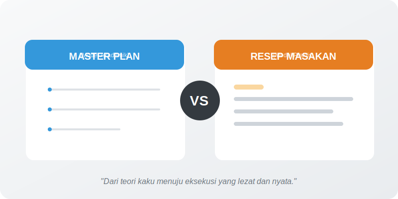

# Bab 01: Design Goals and Philosophy

Chapter Code: CORE-04-01
Version: Core.Fundamentals.04.01
Last Updated: 2026-03-15
Status: Published

> **Deskripsi Singkat**: Memahami tujuan besar di balik terciptanya Python dan filosofi yang membuat kode Python terasa "berbeda" dan lebih manusiawi dibanding bahasa lain.

## 1. Analogi (Pendekatan Konsep)

### Analogi Singkat
> "Desain bahasa itu seperti **Rambu Lalu Lintas**. Rambu yang warnanya konsisten, simbolnya jelas, dan lokasinya terprediksi akan membuat pengemudi (Programmer) bisa mengambil keputusan cepat tanpa harus berhenti dan membaca buku manual setiap saat."

### Analogi Panjang (Arsitek Kota vs Arsitek Mesin)
Bayangkan ada dua orang yang mendesain sebuah kota.

Arsitek pertama fokus pada **Efisiensi Mesin**. Ia membuat jalan yang sangat sempit agar hemat lahan, tanpa rambu (karena mobil "seharusnya" sudah tahu lewat sensor), dan semua gedung terlihat mirip agar mudah dibangun. Hasilnya? Mesin berjalan lancar, tapi manusia yang tinggal di sana stres karena sulit navigasi dan mudah tersesat.

Arsitek kedua (seperti Guido van Rossum saat mendesain Python) fokus pada **User Experience (Manusia)**. Ia membuat trotoar yang lebar agar nyaman dibaca (Readability), rambu yang seragam di setiap sudut agar terprediksi (Consistency), dan aturan yang masuk akal bagi intuisi manusia (Practicality). 

Python bukan didesain untuk menjadi bahasa tercepat bagi mesin (seperti C), melainkan bahasa tercepat bagi **Otak Manusia** untuk memahami logika program.

## 2. Istilah Kunci (Key Terms)

| Istilah | Definisi Singkat | Contoh Nyata |
|---|---|---|
| Design Goal | Sasaran utama yang ingin dicapai bahasa | Keterbacaan (Readability) |
| Philosophy | Prinsip dasar dalam mengambil keputusan | Explicit is better than implicit |
| Practicality | Memilih solusi yang bermanfaat nyata walau tidak sempurna secara teori | Menambahkan fitur "Shortcut" yang sering dipakai |
| Consistency | Kesamaan pola di seluruh bagian bahasa | Penggunaan `len()` untuk semua tipe data |
| Maintainability | Seberapa mudah kode dirawat di masa depan | Kode yang bisa dibaca orang lain setelah 6 bulan |

## 3. Konsep Utama

### A. Keterbacaan adalah Prioritas Utama
Filosofi "Code is read much more often than it is written" adalah jantung Python. Kode harus terlihat seperti kalimat bahasa Inggris yang terstruktur, bukan sekadar simbol matematika yang padat.

### B. Kesederhanaan yang Realistis (Practicality)
Python lebih memilih solusi yang "praktis" dan "berguna" di dunia nyata daripada mengejar kesempurnaan teori ilmu komputer yang sulit digunakan. Jika dua cara sama-sama benar, Python akan memilih cara yang paling intuitif bagi manusia.

### C. Konsistensi Antarpola
Dalam Python, cara Anda mendapatkan panjang sebuah List sama dengan cara Anda mendapatkan panjang sebuah string atau dictionary (menggunakan `len()`). Konsistensi ini mengurangi "beban kognitif" otak Anda karena tidak perlu menghafal banyak pola yang berbeda-beda.

### D. Fokus pada Produktivitas
Bahasa didesain agar Anda sebagai developer bisa menyelesaikan masalah bisnis atau riset dengan cepat, tanpa harus dipusingkan oleh detail teknis rendah (seperti manajemen memori manual).

## 4. Visualisasi Analogi

## 5. Peringatan / Jebakan Umum (Gotchas)

- **"Yang Penting Jalan"**: Ini adalah musuh utama filosofi Python. Kode yang jalan tapi tidak bisa dibaca adalah "utang teknis" yang akan sangat mahal harganya di kemudian hari.
- **"Python Itu Terlalu Gampang"**: Miskonsepsi ini sering membuat orang abai pada desain. Justru karena Python mudah digunakan banyak orang, kita butuh standar desain yang kuat agar kode tim tetap konsisten.
- **Over-Logic**: Jangan menulis logika yang sangat padat (one-liner) hanya agar terlihat pintar. Jika rekan setim Anda butuh waktu 5 menit untuk memahami satu baris kode Anda, berarti Anda gagal menerapkan filosofi Python.

## 6. Referensi Kode Praktik

Buka folder `examples/` untuk melihat penerapan langsung:
- `01_readability_comp.py`: Perbandingan kode gaya "Mesin" vs gaya "Manusia".
- `02_practical_naming.py`: Pentingnya penamaan yang menjelaskan niat (Intent).

## 7. Latihan (Validasi)

- [ ] Cari satu fungsi lama Anda yang namanya hanya satu huruf (misal `f()`), lalu ubah menjadi nama yang deskriptif.
- [ ] Refactor sebuah blok kode yang memiliki *Nested If* lebih dari 3 tingkat menjadi lebih datar (Flat).
- [ ] Tuliskan 3 alasan mengapa keterbacaan kode lebih penting daripada jumlah karakter yang sedikit.

