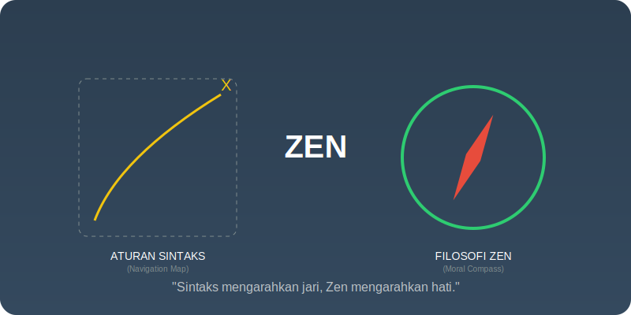

# Bab 02: The Zen of Python

Chapter Code: CORE-04-02
Version: Core.Fundamentals.04.01
Last Updated: 2026-03-15
Status: Published

> **Deskripsi Singkat**: Mempraktikkan "Kitab Suci" Python (PEP 20) sebagai kompas pengambilan keputusan saat Anda bingung memilih cara terbaik untuk menulis sebuah fungsi.

## 1. Analogi (Pendekatan Konsep)

### Analogi Singkat
> "The Zen of Python itu seperti **Kompas di Tengah Badai**. Saat Anda punya 10 cara untuk menyelesaikan sebuah masalah dan otak Anda mulai pening, Zen memberikan arah mana yang paling 'Pythonic' agar Anda tidak tersesat dalam kompleksitas."

### Analogi Panjang (Manual vs Checklist Pilot)
Bayangkan Anda adalah seorang pilot pemula. Menghafal seluruh sistem pesawat itu mustahil di awal. Namun, Anda dibekali sebuah **Checklist Pendek (Zen)** yang berisi prinsip-prinsip keselamatan:
- "Lebih baik terlihat jelas daripada tersembunyi" (Explicit > Implicit).
- "Jika ada masalah, jangan didiamkan" (Errors never pass silently).

Checklist ini tidak memberi tahu Anda "cara menerbangkan pesawat secara teknis", tapi ia memberi tahu Anda **"cara mengambil keputusan yang menyelamatkan nyawa"** saat situasi menjadi rumit. 

Begitu pula Zen of Python. Ia bukan aturan sintaks, melainkan panduan moral untuk menjaga kode Anda tetap sehat, bersih, dan bisa dipahami oleh manusia lain.

## 2. Istilah Kunci (Key Terms)

| Istilah | Definisi Singkat | Cara Akses |
|---|---|---|
| Zen of Python | Kumpulan 19 prinsip filosofi desain Python | Jalankan `import this` |
| Aphorism | Kalimat singkat yang mengandung kebenaran mendalam | - |
| Explicitness | Kejelasan niat kode tanpa mengandalkan "sihir" otomatis | Named arguments |
| Ambiguity | Kondisi di mana kode bisa ditafsirkan ganda | API yang tidak konsisten |
| Practicality | Mendahulukan kegunaan nyata daripada teori murni | `try...except` yang pragmatis |

## 3. Konsep Utama

### A. Explicit is Better Than Implicit (Tanpa Sihir)
Python tidak suka hal-hal yang terjadi "di balik layar" tanpa sepengetahuan programmer. Lebih baik menulis kode sedikit lebih panjang tapi jelas asalnya, daripada kode pendek yang penuh dengan asumsi atau variabel gaib.

### B. Simple is Better Than Complex (Solusi vs Puzzle)
Jika masalah bisa diselesaikan dengan `if-else` sederhana, jangan gunakan *Metaclass* atau *Decorator* yang berbelit. Kode yang bagus bukan yang membuat orang berkata "Wow, pintarnya dia!", tapi yang membuat orang berkata "Ah, saya paham maksudnya."

### C. Flat is Better Than Nested (Lapis-lapis Logika)
Hindari membuat blok kode yang menjorok terlalu jauh ke dalam (indented). Logika yang "Datar" lebih mudah diikuti mata daripada logika yang berlapis-lapis seperti bawang.

### D. Errors Should Never Pass Silently
Jangan pernah menelan *error* mentah-mentah dengan `except: pass`. Jika ada yang rusak, biarkan program memberi tahu Anda apa yang salah, sehingga Anda bisa memperbaikinya secepat mungkin.

## 4. Visualisasi Analogi

## 5. Peringatan / Jebakan Umum (Gotchas)

- **One-liner Mania**: Banyak orang merasa "Pythonic" berarti menulis 20 perintah dalam satu baris. Padahal, Zen berkata "Readability Counts". Jika satu baris itu sulit dibaca, pecahlah menjadi tiga baris.
- **Hafalan Tanpa Makna**: Jangan hanya menghafal prinsipnya, tapi pahami kapan harus menerapkannya. Terkadang "Practicality beats purity"—kita butuh kompromi di dunia nyata.
- **Kultus Pythonic**: Jangan gunakan Zen untuk menghakimi rekan tim secara kasar. Gunakan Zen sebagai alat diskusi untuk mencari solusi terbaik bersama.

## 6. Referensi Kode Praktik

Buka folder `examples/` untuk melihat penerapan langsung:
- `01_explicit_example.py`: Demonstrasi mengapa argument eksplisit lebih baik dari pada sihir global.
- `02_error_handling_zen.py`: Cara menangani error tanpa membisukannya secara berbahaya.

## 7. Latihan (Validasi)

- [ ] Jalankan `import this` di terminal Anda dan pilih 1 prinsip yang paling sering Anda langgar, lalu jelaskan alasannya.
- [ ] Temukan kode *Nested If* di proyek Anda dan ubah menggunakan *Guard Clause* agar lebih "Flat".
- [ ] Buat fungsi pembagi angka yang menangani `ZeroDivisionError` secara eksplisit alih-alih menggunakan `except Exception`.

