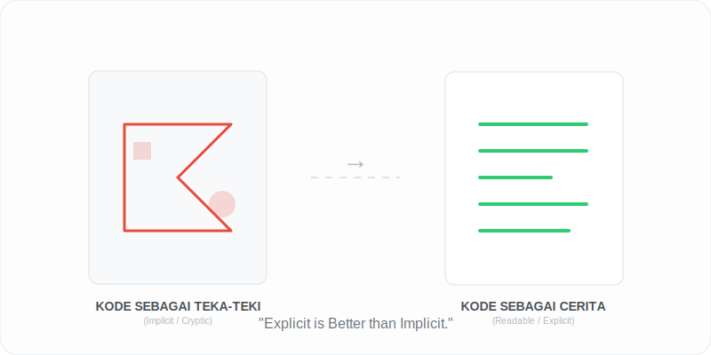

# Bab 03: Readability and Explicitness

Chapter Code: CORE-04-03
Version: Core.Fundamentals.04.01
Last Updated: 2026-03-15
Status: Published

> **Deskripsi Singkat**: Membahas mengapa kode harus ditulis sejelas mungkin untuk manusia (Readability) dan mengapa kita harus menghindari "sihir" otomatis yang samar (Explicitness).

## 1. Analogi (Pendekatan Konsep)

### Analogi Singkat
> "Menulis kode itu seperti menulis **Resep Masakan**. Resep yang samar seperti 'tambahkan bumbu secukupnya' bisa berujung bencana, sementara resep yang jelas seperti 'tambahkan 2 sendok teh garam' menjamin siapa pun yang memasaknya akan mendapatkan rasa yang sama."

### Analogi Panjang (Surat untuk Masa Depan)
Bayangkan Anda menulis sepucuk surat untuk diri Anda sendiri yang akan dibaca 5 tahun lagi. 

Jika surat itu berisi kode rahasia yang hanya Anda pahami hari ini (seperti variabel `x`, `y`, `z`), maka 5 tahun lagi Anda sendiri pun akan kebingungan membacanya. Anda akan menghabiskan waktu berjam-jam hanya untuk mengingat apa maksud dari surat tersebut.

Di Python, kita menulis kode seolah-olah pembaca berikutnya adalah seorang psikopat yang tahu di mana kita tinggal dan sangat mudah marah jika melihat kode yang berantakan. Kita menulis kode untuk **Manusia Lain**, bukan hanya untuk mesin. Kita ingin niat (intent) kita langsung terlihat jelas tanpa perlu menebak-nebak.

## 2. Istilah Kunci (Key Terms)

| Istilah | Definisi Singkat | Contoh |
|---|---|---|
| Readability | Kemudahan kode dipahami oleh mata dan otak manusia | Nama variabel deskriptif |
| Explicitness | Menuliskan niat program secara nyata, bukan tersirat | Menggunakan `named arguments` |
| Implicit | Sesuatu yang terjadi otomatis "di balik layar" tanpa tertulis | Fallback nilai diam-diam |
| Cognitive Load | Beban pikiran yang dibutuhkan untuk memahami satu baris kode | Nested logic yang dalam |
| API Contract | Kesepakatan jelas tentang apa yang masuk dan keluar dari fungsi | Type hints & Exceptions |

## 3. Konsep Utama

### A. Kode untuk Manusia (Readability)
Python didesain dengan asumsi bahwa kode akan dibaca jauh lebih sering daripada ditulis. Oleh karena itu, sintaks Python dibuat mirip bahasa Inggris. Gunakan spasi yang cukup, penamaan yang jelas, dan struktur yang rapi.

### B. Tanpa Sihir (Explicitness)
Di Python, *"Explicit is better than implicit"*. Jangan biarkan fungsi Anda menebak-nebak keinginan user. Jika ada data yang salah, beri tahu user secara eksplisit lewat *Error*, jangan memberikan hasil tebakan (fallback) yang salah secara diam-diam.

### C. Nama yang Menjelaskan Niat
Nama variabel `data_pengguna` jauh lebih baik daripada `d`. Nama fungsi `hitung_pajak_tahunan()` jauh lebih baik daripada `calc()`. Nama yang baik bertindak sebagai dokumentasi yang hidup.

### D. Mengurangi Beban Pikiran (Cognitive Load)
Gunakan *Guard Clauses* (cek kondisi di awal dan langsung keluar jika salah) untuk menghindari percabangan `if-else` yang menjorok terlalu dalam. Semakin datar struktur kode Anda, semakin ringan beban otak pembacanya.

## 4. Visualisasi Analogi

## 5. Peringatan / Jebakan Umum (Gotchas)

- **"Kode Pendek = Hebat"**: Menulis kode dalam satu baris panjang (one-liner) mungkin terlihat keren, tapi jika sulit dibaca, itu adalah kode yang buruk menurut standar Python.
- **Variabel Misterius**: Hindari nama variabel seperti `a`, `b`, `temp`, atau `data`. Berikan nama yang spesifik sesuai fungsinya.
- **Komentar yang Mengulang Kode**: Jangan menulis komentar `# menambahkan 1 ke x` di atas kode `x += 1`. Komentar harus menjelaskan **MENGAPA** (alasan bisnis), bukan **APA** (yang sudah jelas terlihat di kode).

## 6. Referensi Kode Praktik

Buka folder `examples/` untuk melihat penerapan langsung:
- `01_naming_standard.py`: Contoh transformasi dari kode "Misterius" ke kode "Bercerita".
- `02_explicit_contract.py`: Bagaimana validasi eksplisit menyelamatkan program dari bug tersembunyi.

## 7. Latihan (Validasi)

- [ ] Ambil satu file kode lama Anda, tutupi bagian komentarnya, dan coba baca apakah Anda tetap paham maksudnya hanya dari nama variabel dan fungsinya.
- [ ] Ubahlah sebuah fungsi yang memiliki parameter membingungkan menjadi fungsi dengan *Keyword-Only Arguments* agar pemanggilannya lebih eksplisit.
- [ ] Tulis ulang sebuah blok `if-else` bertingkat menggunakan teknik *Early Return* (Guard Clause).
