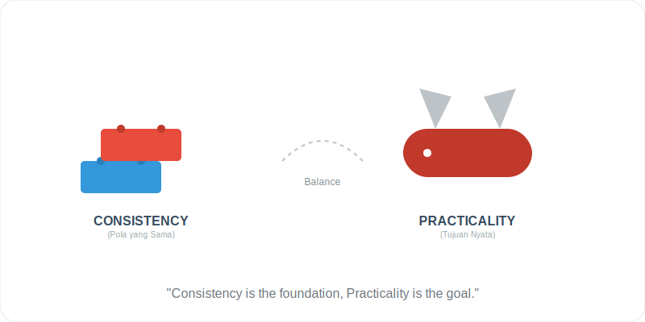

# Bab 04: Consistency and Practicality

Chapter Code: CORE-04-04
Version: Core.Fundamentals.04.01
Last Updated: 2026-03-15
Status: Published

> **Deskripsi Singkat**: Menyeimbangkan antara menjaga keteraturan pola (Consistency) dengan kebutuhan mendesak untuk menyelesaikan masalah di dunia nyata (Practicality).

## 1. Analogi (Pendekatan Konsep)

### Analogi Singkat
> "Konsistensi itu seperti **Blok Lego**—walaupun warnanya berbeda, semua punya ukuran tonjolan yang sama sehingga bisa saling menyambung. Sementara itu, Praktikalitas itu seperti **Pisau Lipat**—mungkin bukan alat pemotong pohon yang ideal secara teori, tapi dialah yang paling berguna dan siap sedia di saku Anda saat dibutuhkan."

### Analogi Panjang (Seragam Tentara vs Pakaian Kerja)
Bayangkan sebuah pasukan tentara. Mereka semua memakai **Seragam yang Konsisten**. Mengapa? Agar dalam kondisi darurat (perang/badai), mereka bisa saling mengenali dengan cepat tanpa perlu bertanya "Siapa kamu?". Dalam kode, konsistensi pola membuat programmer lain bisa langsung mengenali maksud sebuah fungsi hanya dengan melihat strukturnya.

Namun, bayangkan jika tentara tersebut harus memperbaiki mesin di tengah jalan yang berlumpur. Jika mereka terlalu kaku menjaga "kebersihan seragam" (Purity) dan menolak kotor, mesin tidak akan pernah jalan. Di sinilah **Praktikalitas** masuk. Terkadang, kita perlu "mengotori tangan" dengan solusi yang mungkin sedikit menyimpang dari teori murni, asalkan solusi itu benar-benar menyelesaikan masalah dan membuat sistem kembali berjalan.

Python adalah bahasa yang mencintai keteraturan, tapi ia lebih mencintai **Hasil Nyata**.

## 2. Istilah Kunci (Key Terms)

| Istilah | Definisi Singkat | Contoh |
|---|---|---|
| Consistency | Keseragaman pola agar perilaku kode mudah diprediksi | Struktur `try-except` yang sama di semua modul |
| Practicality | Keputusan yang mendahulukan kegunaan nyata daripada keindahan teori | Menggunakan `print()` sederhana untuk debug cepat |
| Purity | Idealisme desain yang mengikuti teori 100% tanpa kompromi | Arsitektur yang terlalu kompleks padahal hanya butuh fungsi kecil |
| Convention | Aturan tidak tertulis yang disepakati bersama oleh tim | Format penamaan `snake_case` |
| Uniformity | Kesamaan tampilan dan rasa di seluruh bagian proyek | Dokumentasi yang formatnya seragam |

## 3. Konsep Utama

### A. Kekuatan Pola yang Sama (Consistency)
Konsistensi bukan tentang membatasi kreativitas, tapi tentang mengurangi "kejutan" (Surprise). Jika semua fungsi validasi di proyek Anda mengembalikan `True/False`, jangan tiba-tiba membuat satu fungsi yang mengembalikan `1/0`. Gunakan pola yang sudah ada agar rekan tim Anda tidak perlu berpikir dua kali.

### B. Pragmatisme di Atas Teori
Python sering kali memilih solusi yang "sedikit tidak rapi secara teori" asalkan itu membuat programmer lebih produktif. Contoh: Python mengizinkan akses ke atribut internal (dengan prefix `_`), karena secara praktis programmer terkadang memang perlu melakukannya untuk perbaikan cepat, daripada dipaksa membuat sistem *Getter/Setter* yang rumit seperti di Java.

### C. Konsistensi API
Pastikan cara memanggil fungsi Anda seragam. Jika fungsi pertama menerima `(data, identifier)`, usahakan fungsi kedua juga menerima urutan yang sama, bukan dibalik menjadi `(identifier, data)`. Otak manusia bekerja dengan pengenalan pola; hargailah itu.

### D. Memilih Keputusan yang Berguna
Timbangan terbaik saat Anda bingung mendesain sesuatu adalah: "Mana yang lebih memudahkan tim dalam merawat kode ini 3 bulan lagi?". Jika desain ideal Anda ternyata sangat sulit dipahami orang lain, pilihlah desain yang lebih praktis dan sederhana.

## 4. Visualisasi Analogi

## 5. Peringatan / Jebakan Umum (Gotchas)

- **Fanatik Teori**: Jangan menolak solusi yang jalan hanya karena "tidak sesuai dengan buku desain arsitektur halaman 50". Ingat, tujuan utama program adalah memecahkan masalah bisnis/pengguna.
- **Inkonsistensi Kreatif**: Sering terjadi saat programmer mencoba "cara baru yang lebih keren" di tengah proyek yang sudah punya standar. Ini adalah bencana bagi *maintenance*. Gunakan standar lama sampai ada keputusan tim untuk mengubahnya secara global.
- **Over-Engineering**: Membangun sistem yang sangat fleksibel (generalisasi berlebihan) padahal kebutuhan saat ini sangat spesifik. Ini melanggar prinsip praktikalitas.

## 6. Referensi Kode Praktik

Buka folder `examples/` untuk melihat penerapan langsung:
- `01_consistency_pattern.py`: Standarisasi struktur fungsi (Validasi -> Proses -> Output).
- `02_practical_decision.py`: Contoh kapan kita memilih solusi pragmatis vs solusi ideal yang rumit.

## 7. Latihan (Validasi)

- [ ] Periksa 3 fungsi berbeda di modul Anda. Pastikan urutan parameter dan cara penanganan *error*-nya sudah seragam (konsisten).
- [ ] Berikan satu contoh kasus di kode Anda di mana Anda terpaksa melanggar "Best Practice" demi menyelesaikan masalah yang mendesak, dan jelaskan alasan praktisnya.
- [ ] Tulislah 3 standar penamaan yang akan Anda gunakan secara konsisten untuk seluruh proyek ini (misal: semua fungsi API harus diawali dengan `fetch_`).
