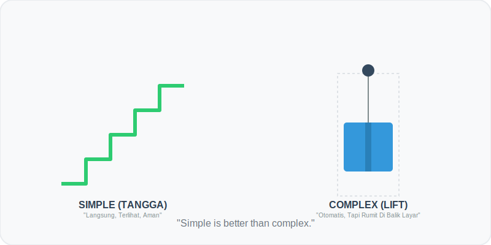

# Bab 05: Simple vs Complex

Chapter Code: CORE-04-05
Version: Core.Fundamentals.04.01
Last Updated: 2026-03-15
Status: Published

> **Deskripsi Singkat**: Menghargai kesederhanaan desain dan belajar mendeteksi kapan sebuah solusi mulai menjadi terlalu rumit tanpa alasan yang jelas (Accidental Complexity).

## 1. Analogi (Pendekatan Konsep)

### Analogi Singkat
> "Sederhana (Simple) itu seperti **Tangga**—pijakannya langsung terlihat, tidak ada mesin tersembunyi, dan tetap bisa dipakai walau lampu mati. Sementara Rumit (Complex) itu seperti **Lift**—nyaman dan otomatis, tapi di balik dindingnya ada ribuan kabel, sensor, dan motor yang jika satu saja rusak, seluruh sistem macet total."

### Analogi Panjang (Teka-Teki vs Instruksi)
Bayangkan Anda memberikan petunjuk jalan kepada seorang teman.

Cara pertama (**Sederhana**): "Jalan lurus 100 meter, lalu belok kanan di depan minimarket." Instruksi ini linear, mudah diingat, dan sulit salah tafsir.

Cara kedua (**Rumit/Complex**): "Gunakan koordinat GPS ini, tapi jika satelit sedang error, gunakan kompas dengan deklinasi 2 derajat, kecuali jika hari ini hari Selasa, maka Anda harus memutar lewat jalan tikus di belakang gudang." Instruksi ini mungkin "pintar" karena mencakup segala kemungkinan, tapi ia menciptakan beban pikiran (Cognitive Load) yang luar biasa besar bagi teman Anda.

Di Python, kita lebih menghargai "Tangga" dan "Instruksi Lurus". Kita tidak ingin membuat rekan tim kita merasa seperti sedang menyelesaikan teka-teki logika setiap kali membaca kode kita.

## 2. Istilah Kunci (Key Terms)

| Istilah | Definisi Singkat | Contoh |
|---|---|---|
| Simple | Desain yang mudah dipahami dan minim interaksi antarbagian | Fungsi mandiri yang spesifik |
| Complex | Banyak bagian yang saling bergantung (Dependency) | Class yang butuh 5 class lain agar bisa jalan |
| Complicated | Kerumitan yang muncul karena desain buruk (bisa dihindari) | Kode "Spaghetti" yang berbelit-belit |
| Flat | Struktur yang mendatar, tidak berlapis-lapis | Kode tanpa nested `if` atau `for` yang dalam |
| Over-engineering | Membuat solusi raksasa untuk masalah yang sangat kecil | Membangun framework hanya untuk hitung diskon |

## 3. Konsep Utama

### A. Sederhana Lebih Baik (Simple > Complex)
Zen of Python mengatakan: *"Simple is better than complex"*. Jika Anda bisa menyelesaikan masalah dengan List sederhana, jangan paksa menggunakan Database. Jika fungsi biasa sudah cukup, jangan paksa membuat Class.

### B. Menghindari "Plester" (Complicated)
Terkadang masalah memang sulit (Complex), dan itu wajar. Yang tidak wajar adalah jika kita memperumit masalah dengan desain yang buruk (Complicated). Jangan gunakan "plester" atau solusi tambal sulam untuk menutupi kesalahan logika. Perbaikilah fondasinya.

### C. Flat is Better than Nested
Bayangkan membaca buku yang di dalamnya ada lipatan, lalu di dalam lipatan ada kantong kecil, lalu di dalamnya ada kertas gulung. Melelahkan, bukan? Begitu juga dengan kode. Hindari `if` di dalam `for` di dalam `if` lagi. Usahakan alur kode Anda "flat" (datar).

### D. Satu Masalah = Satu Solusi Jelas
Hindari membuat fungsi "Super" yang bisa melakukan 10 hal sekaligus. Pecahlah menjadi 10 fungsi sederhana yang masing-masing melakukan satu hal dengan sempurna.

## 4. Visualisasi Analogi

## 5. Peringatan / Jebakan Umum (Gotchas)

- **"Solusi Pintar"**: Jangan bangga jika Anda bisa menulis logika rumit dalam 1 baris (one-liner) yang tidak dipahami orang lain. Di dunia kerja, itu adalah beban, bukan prestasi.
- **Lapis-lapis Abstraksi**: Terlalu banyak membuat "Wrapper" atau "Decorator" hanya agar terlihat profesional sering kali justru mempersulit proses *debugging*.
- **Asal Bisa Dicopy-Paste**: Sering kali kita menambah kerumitan hanya karena malas berpikir dan memilih menyalin kode besar dari internet yang sebenarnya mengandung banyak hal yang tidak kita butuhkan.

## 6. Referensi Kode Praktik

Buka folder `examples/` untuk melihat penerapan langsung:
- `01_flat_vs_nested.py`: Teknik merombak kode "Bawang" (berlapis) menjadi "Jalan Tol" (datar).
- `02_one_task_one_function.py`: Cara pecah-belah fungsi raksasa menjadi unit-unit sederhana.

## 7. Latihan (Validasi)

- [ ] Temukan satu blok kode di proyek Anda yang menjorok (indent) lebih dari 3 tingkat, lalu sederhanakan.
- [ ] Refactor sebuah fungsi "Super" (yang melakukan banyak hal) menjadi minimal 2 fungsi sederhana yang fokus.
- [ ] Tuliskan narasi singkat (3-5 kalimat) mengapa Anda memilih solusi paling sederhana untuk fitur terakhir yang Anda buat.
