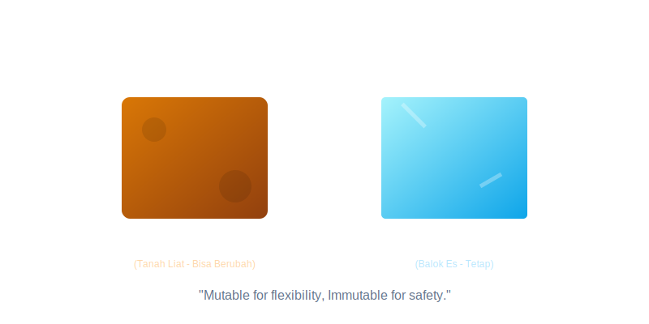

# Mutability and Object Thinking

Chapter Code: CORE-04-06
Book Code: CORE-04
Version: Core.Fundamentals.04.00
Last Updated: 2026-03-14
Status: Draft
Difficulty: Intermediate
Estimated Time: 45 menit teori + 35 menit praktik

## Bab Ini Tentang Apa

Bab ini membahas cara berpikir objek di Python melalui konsep mutability: mana objek yang bisa berubah, mana yang tidak, dan bagaimana perubahan itu memengaruhi state program. Fokus utamanya adalah mencegah bug akibat referensi bersama (shared references) yang tidak disadari.

## Prasyarat Spesifik Bab

- sudah menyelesaikan CORE-04-01 sampai CORE-04-05
- memahami list, dict, tuple, function parameter, dan class dasar
- memahami error handling dan debugging sederhana

## Istilah Kunci

| Istilah | Definisi Singkat | Contoh |
|---|---|---|
| mutable object | objek yang bisa diubah setelah dibuat | `list`, `dict`, `set` |
| immutable object | objek yang tidak bisa diubah setelah dibuat | `int`, `str`, `tuple` |
| reference | variabel menunjuk ke objek yang sama di memori | `b = a` pada list |
| shared state | beberapa bagian kode mengubah objek yang sama | list config dipakai lintas fungsi |
| defensive copy | menyalin data untuk mencegah side effect | `items.copy()` |

## Tujuan Besar

Membantu pembaca mengambil keputusan desain berbasis pemahaman mutability agar perilaku data tetap dapat diprediksi dan aman dirawat.

## Tujuan Kecil

- membedakan mutasi in-place vs membuat objek baru
- menghindari bug dari shared mutable state
- mendesain fungsi/API dengan kontrak mutability yang jelas

## Hasil Belajar

Setelah menyelesaikan bab ini, pembaca diharapkan mampu:

- menjelaskan dampak reference semantics terhadap perilaku kode
- mengenali dan memperbaiki bug mutable default argument
- memilih kapan perlu copy data untuk menjaga isolasi state

## Peruntukan

Bab ini digunakan saat:

- merancang fungsi yang menerima list/dict sebagai input
- menulis class yang menyimpan state internal
- melakukan debugging bug yang muncul karena data "berubah sendiri"

## Bukan Peruntukan

Bab ini bukan untuk:

- pembahasan detail manajemen memori CPython tingkat rendah
- optimisasi performa ekstrem berbasis object layout
- pengganti materi data structure mendalam

## Analogi

Bayangkan list seperti papan tulis bersama. Jika banyak orang menulis di papan yang sama, semua orang melihat perubahan. Kalau ingin catatan pribadi, Anda perlu fotokopi papan itu terlebih dahulu.

## Miskonsepsi Umum

- Miskonsepsi: "Assignment membuat salinan objek."
  Klarifikasi: assignment hanya menyalin referensi; objek aslinya tetap sama.

- Miskonsepsi: "Tuple selalu sepenuhnya immutable."
  Klarifikasi: tuple immutable, tapi bisa berisi objek mutable di dalamnya.

- Miskonsepsi: "Bug mutable default argument itu edge case langka."
  Klarifikasi: ini bug umum di kode Python pemula hingga menengah.

## Konsep Inti

### 1. Prinsip Dasar

Empat prinsip kerja saat berurusan dengan mutability:

1. Ketahui jenis objek
Sebelum memodifikasi data, pastikan objeknya mutable atau immutable.

2. Bedakan alias vs copy
`b = a` membuat alias (referensi sama). `b = a.copy()` membuat objek baru (dangkal).

3. Jelaskan kontrak mutasi
Fungsi harus jelas apakah mengubah argumen input atau mengembalikan objek baru.

4. Hindari state tersembunyi
Default argument mutable atau state global mutable sering menghasilkan bug non-deterministik.

### 2. Dampak Praktis

Di proyek nyata, pemahaman ini berdampak pada:

- desain API yang lebih aman terhadap side effect
- debugging lebih cepat karena alur perubahan state terlihat
- test lebih stabil karena data test tidak saling memengaruhi
- refactor lebih aman saat fungsi dipakai banyak tempat

Checklist saat menulis fungsi yang menerima list/dict:

1. apakah fungsi ini mutasi input atau tidak
2. jika mutasi, apakah caller tahu dan setuju
3. jika tidak mutasi, apakah perlu defensive copy
4. apakah default parameter aman (gunakan `None` untuk mutable)

## Diagram



Caption: Diagram menunjukkan hubungan antara referensi objek, mutasi, dan konsekuensinya terhadap prediktabilitas state program.

### Legenda Diagram

- 1: objek dan referensi
- 2: keputusan mutasi/copy
- 3: dampak side effect ke alur program

## Contoh Kode (Benar)

```python
from typing import Iterable


def add_tag(tags: Iterable[str] | None, new_tag: str) -> list[str]:
    current_tags = list(tags) if tags is not None else []
    current_tags.append(new_tag)
    return current_tags


original = ["python", "design"]
updated = add_tag(original, "core")

print(original)
print(updated)
```

Expected output:

```text
['python', 'design']
['python', 'design', 'core']
```

## Pitfall Umum

Contoh kesalahan yang sering terjadi:

```python
def add_tag(tags=[], new_tag="python"):
    tags.append(new_tag)
    return tags
```

Masalah:

- default list dibuat sekali saat fungsi didefinisikan
- pemanggilan berikutnya membawa state lama tanpa disadari
- menghasilkan bug lintas request/test

Perbaikan:

```python
def add_tag(tags=None, new_tag="python"):
    if tags is None:
        tags = []
    result = list(tags)
    result.append(new_tag)
    return result
```

## Catatan Praktis

- gunakan `None` sebagai default untuk parameter mutable
- tulis docstring singkat: fungsi mutasi input atau tidak
- lakukan copy saat ingin mengisolasi state caller
- hati-hati dengan nested mutable (copy dangkal vs deep copy)
- test kasus side effect secara eksplisit

## Latihan

### Dasar

Buat contoh kecil yang menunjukkan perbedaan `b = a` dan `b = a.copy()` pada list.

### Menengah

Refactor fungsi yang memodifikasi argumen input menjadi fungsi pure (mengembalikan objek baru).

### Mini Challenge

Buat file `cart_state.py` berisi:

- fungsi tambah item ke cart
- fungsi hapus item dari cart
- fungsi hitung total item

Syarat:

- fungsi tidak boleh mengubah input cart asli
- tambahkan minimal 5 test case, termasuk kasus list kosong dan repeated call
- tulis 5-8 kalimat: keputusan mutability apa yang Anda ambil dan kenapa

## Checklist Lulus Bab

- [ ] memahami mutable vs immutable object
- [ ] mampu menghindari bug default mutable argument
- [ ] menyelesaikan mini challenge beserta test
- [ ] mampu menjelaskan kapan perlu alias, copy dangkal, atau pendekatan immutable

## Peta Keterkaitan

- Bab sebelumnya: 05_simple_vs_complex.md
- Bab berikutnya: 07_duck_typing_and_protocols.md
- Keterkaitan lintas buku Core: CORE-01, CORE-02, CORE-03

## Ringkasan

- mutability adalah sumber kekuatan sekaligus sumber bug umum di Python
- assignment menyalin referensi, bukan objek
- kontrak mutasi yang jelas meningkatkan prediktabilitas kode
- defensive copy membantu menjaga isolasi state antar komponen

## FAQ Singkat

1. Apakah selalu salah memodifikasi list input langsung?
   Jawaban singkat: tidak, asal kontraknya jelas dan caller memang mengharapkan mutasi.
2. Kapan pakai `deepcopy`?
   Jawaban singkat: saat struktur data bertingkat dan Anda butuh isolasi penuh dari nested object.
3. Kenapa bug mutable default argument sulit dideteksi?
   Jawaban singkat: karena efeknya muncul antar pemanggilan, bukan di satu eksekusi saja.

## Referensi

- Python Tutorial: https://docs.python.org/3/tutorial/
- Python Language Reference: https://docs.python.org/3/reference/
- Python Data Model: https://docs.python.org/3/reference/datamodel.html
- PEP 8 (Style Guide): https://peps.python.org/pep-0008/
