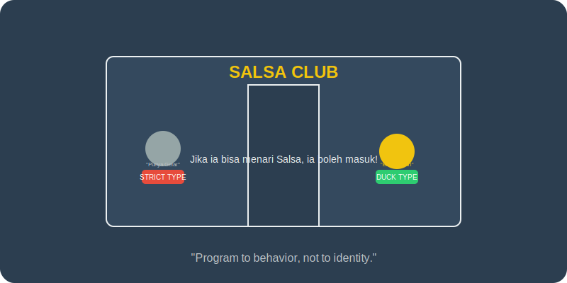

# Bab 07: Duck Typing and Protocols

Chapter Code: CORE-04-07
Version: Core.Fundamentals.04.01
Last Updated: 2026-03-15
Status: Published

> **Deskripsi Singkat**: Mengenal filosofi "Duck Typing" yang membebaskan objek dari batasan silsilah keluarga (Inheritance) dan beralih fokus pada apa yang bisa objek tersebut lakukan (Behavior).

## 1. Analogi (Pendekatan Konsep)

### Analogi Singkat
> "Duck Typing itu seperti sebuah **Klub Dansa Salsa**. Penjaga pintu tidak akan bertanya apakah Anda punya sertifikat penari atau sekolah di mana (Inheritance). Satu-satunya syarat adalah: **Jika Anda bisa menari Salsa, Anda boleh masuk ke lantai dansa.**"

### Analogi Panjang (Charger HP vs Sertifikat Merek)
Bayangkan Anda sedang di bandara dan baterai HP Anda habis. Anda meminjam charger kepada orang di sebelah Anda.

Dalam sistem yang kaku (**Nominal Typing**), HP Anda akan mengecek: "Apakah charger ini berasal dari pabrik yang sama dengan saya? Jika tidak, saya menolak diisi daya." Anda harus membawa charger merek spesifik ke mana-mana.

Dalam sistem Python (**Duck Typing**), HP Anda hanya peduli: "Apakah charger ini punya ujung kabel USB-C? Apakah ia mengeluarkan daya listrik? Jika ya, silakan isi daya saya." HP Anda tidak peduli apakah charger itu bermerek Samsung, Apple, atau rakitan sendiri, selama ia "berperilaku" seperti charger yang Anda butuhkan.

Inilah inti dari Duck Typing: **"Jika ia berjalan seperti bebek dan bersuara seperti bebek, maka bagi Python, ia adalah bebek."**

## 2. Istilah Kunci (Key Terms)

| Istilah | Definisi Singkat | Contoh |
|---|---|---|
| Duck Typing | Penentuan tipe objek berdasarkan method/atributnya | Objek apa pun yang punya `.read()` dianggap file |
| Protocol | Kontrak struktur/perilaku tanpa wajib mewarisi class induk | `typing.Protocol` |
| Nominal Typing | Penentuan tipe berdasarkan deklarasi nama class/parent | `isinstance(x, Manusia)` |
| Structural Typing | Nama lain Duck Typing (kecocokan berdasarkan struktur) | Punya method yang disyaratkan |
| Interface | Antarmuka atau kontrak yang harus dipenuhi sebuah objek | Kumpulan method wajib |

## 3. Konsep Utama

### A. Fokus pada Perilaku (Behavior)
Di Python, kita jarang bertanya "Siapa orang tuamu?" (`isinstance`). Kita lebih sering langsung mencoba: "Bisakah kamu melakukan ini?". Jika sebuah objek punya method `fly()`, kita anggap dia bisa terbang, tidak peduli apakah dia burung, pesawat, atau pahlawan super.

### B. Tanpa Harus Mewarisi (Inherit)
Duck Typing membebaskan kita dari hierarki class yang rumit. Anda tidak perlu membuat class `Kucing` mewarisi dari `HewanBersuara` hanya agar bisa dipanggil fungsi `buat_suara()`. Cukup pastikan `Kucing` punya method `suara()`.

### C. Keajaiban `Protocol` (PEP 544)
Meskipun bebas, terkadang kita ingin "catatan resmi" tentang apa saja syarat untuk masuk ke fungsi kita. `Protocol` adalah cara modern di Python untuk menuliskan kontrak perilaku secara formal tanpa merusak sifat Duck Typing-nya.

### D. Fleksibilitas vs Keamanan
Duck Typing memberikan fleksibilitas luar biasa (lebih mudah diuji/di-mock), tapi memiliki risiko *Runtime Error* jika objek ternyata tidak punya method yang kita minta. Oleh karena itu, *Type Hinting* dan *Protocol* sangat disarankan sebagai pengaman.

## 4. Visualisasi Analogi

## 5. Peringatan / Jebakan Umum (Gotchas)

- **AttributeError di Tengah Jalan**: Risiko terbesar adalah program hancur di tengah jalan karena kita berasumsi objek punya method tertentu padahal tidak. Selalu gunakan `hasattr()` atau `try-except` jika Anda ragu.
- **Sulit Ditelusuri**: Di proyek besar, Duck Typing murni bisa membuat programmer bingung: "Objek apa saja sih yang boleh masuk ke fungsi ini?". Gunakan `Protocol` untuk mendokumentasikannya.
- **Asal Bisa Dipanggil**: Hati-hati, hanya karena dua objek punya method bernama sama (misal `.draw()`), bukan berarti mereka melakukan hal yang sama. Satu mungkin menggambar grafik, yang lain mungkin menarik uang dari ATM. Konteks tetap penting!

## 6. Referensi Kode Praktik

Buka folder `examples/` untuk melihat penerapan langsung:
- `01_duck_typing_demo.py`: Bagaimana satu fungsi bisa menerima berbagai objek berbeda selama mereka punya perilaku yang sama.
- `02_protocol_standard.py`: Menggunakan `typing.Protocol` untuk membuat kontrak yang bersih dan profesional.

## 7. Latihan (Validasi)

- [ ] Buatlah 3 class berbeda (misal: `Mobil`, `Sepeda`, `Manusia`) yang tidak saling mewarisi, tapi semuanya punya method `pindah(lokasi)`. Buat satu fungsi `perjalanan` yang bisa menerima ketiganya.
- [ ] Implementasikan sebuah `Protocol` sederhana untuk objek yang bisa "Bersuara" (`speak`), lalu gunakan *Static Type Checker* (seperti Mypy) untuk memvalidasinya.
- [ ] Tuliskan 2 situasi di mana Duck Typing lebih baik daripada inheritance, dan 1 situasi di mana inheritance justru lebih aman.
