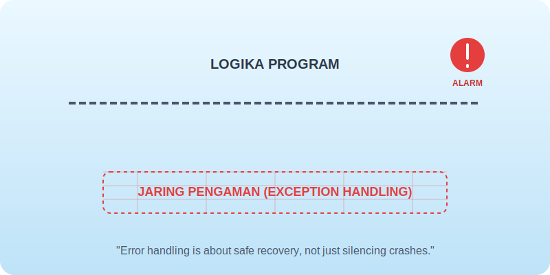

# Bab 08: Errors as Part of Design

Chapter Code: CORE-04-08
Version: Core.Fundamentals.04.01
Last Updated: 2026-03-15
Status: Published

> **Deskripsi Singkat**: Memandang "Error" bukan sebagai kegagalan sistem, melainkan sebagai bagian dari desain program yang membantu kita berkomunikasi dengan pengguna atau programmer lain saat ada sesuatu yang berjalan di luar rencana.

## 1. Analogi (Pendekatan Konsep)

### Analogi Singkat
> "Penanganan Error itu seperti **Jaring Pengaman (Safety Net)** di sirkus—ia tidak mencegah Anda jatuh, tapi ia memastikan saat Anda jatuh, Anda tidak celaka dan bisa segera naik kembali untuk mencoba lagi."

### Analogi Panjang (Sensor Parkir vs Rem Mendadak)
Bayangkan Anda sedang memarkir mobil di garasi yang sempit.

Ada dua jenis mobil. Mobil pertama hanya punya **Rem Otomatis (LBYL - Look Before You Leap)**. Ia akan mengecek setiap milimeter jarak ke tembok, dan jika ia rasa akan menabrak, ia menolak bergerak. Ini sangat aman, tapi terkadang membuat Anda frustrasi karena mobil berhenti terlalu jauh dari tembok hanya karena ia "terlalu takut".

Mobil kedua punya **Sensor Alarm (EAFP - Easier to Ask Forgiveness than Permission)**. Ia membiarkan Anda menyetir dengan bebas, tapi ia akan berteriak "BEEP! BEEP!" saat Anda sudah sangat dekat dengan tembok. Anda baru menginjak rem saat alarm berbunyi. Di Python, kita lebih sering menggunakan gaya kedua: jalankan saja kodenya, dan tangani masalahnya jika (dan hanya jika) masalah itu benar-benar muncul.

Error bukanlah bencana; ia adalah **Laporan Status** yang memberi tahu kita bahwa realita tidak sesuai dengan rencana kode kita.

## 2. Istilah Kunci (Key Terms)

| Istilah | Definisi Singkat | Contoh |
|---|---|---|
| Exception | Kejadian luar biasa yang menghentikan alur normal program | `ZeroDivisionError` |
| Traceback | Laporan "peta jalan" yang menunjukkan di baris mana error terjadi | Pesan merah di terminal |
| EAFP | Filosofi "Jalankan dulu, urus error-nya nanti" | `try...except` |
| LBYL | Filosofi "Cek dulu semua sebelum mulai" | `if os.path.exists(f):` |
| Fail-Fast | Prinsip untuk segera menghentikan program saat ada input salah | Validasi input di awal fungsi |

## 3. Konsep Utama

### A. Error Bukan Musuh
Jangan membenci Error. Jika program Anda *crash* dengan pesan `FileNotFoundError`, ia sedang menyelamatkan Anda dari pengolahan data kosong yang bisa merusak database. Error adalah sistem pertahanan dini.

### B. EAFP: Minta Maaf > Izin
Python mendorong gaya *Easier to Ask Forgiveness than Permission*. Alih-alih mengecek 10 kondisi `if` sebelum membuka file, langsung saja `try` buka filenya. Jika gagal, tangani di blok `except`. Ini membuat alur utama kode Anda lebih bersih dan mudah dibaca.

### C. Gagal dengan Suara Keras (Fail Loudly)
Jika kode Anda menghadapi masalah yang tidak bisa diselesaikan, biarkan ia gagal (Raise Exception). Jangan mencoba "sok pintar" dengan memberikan hasil tebakan (misal mengembalikan `0` saat ada error), karena itu akan membuat bug sulit dilacak di masa depan.

### D. Pesan Error yang Berguna
Saat me-raise error, berikan pesan yang membantu manusia memperbaikinya. Bandingkan: `"Error!"` dengan `"Gagal memproses transaksi: Saldo kurang (Butuh: 100rb, Ada: 50rb)"`. Pesan kedua adalah desain yang baik.

## 4. Visualisasi Analogi

## 5. Peringatan / Jebakan Umum (Gotchas)

- **Membungkam Error**: Penggunaan `except: pass` adalah dosa besar dalam desain Python. Ia seperti mematikan alarm kebakaran saat gedung sedang terbakar. Anda tidak akan tahu ada masalah sampai semuanya hangus.
- **Error Generic**: Jangan menggunakan `except Exception:` jika Anda hanya ingin menangkap `ValueError`. Menangkap terlalu luas bisa menyembunyikan bug lain (seperti `KeyboardInterrupt`).
- **Logika di dalam Except**: Jaga agar blok `except` tetap tipis. Hanya lakukan pemulihan (recovery) atau pelaporan (logging), jangan menaruh logika bisnis utama di sana.

## 6. Referensi Kode Praktik

Buka folder `examples/` untuk melihat penerapan langsung:
- `01_eafp_style.py`: Perbandingan gaya "Cek Dulu" vs gaya "Jalankan Dulu".
- `02_custom_exceptions.py`: Cara membuat "Alarm Khusus" untuk logika bisnis Anda sendiri.

## 7. Latihan (Validasi)

- [ ] Cari blok `try-except` di kode Anda yang menangkap `Exception` secara umum, dan persempit menjadi tipe exception yang spesifik.
- [ ] Buatlah sebuah fungsi yang memvalidasi umur pengguna, dan raise `ValueError` dengan pesan yang menjelaskan batas umur minimum yang diperbolehkan.
- [ ] Tuliskan sebuah skrip yang mencoba membuka sebuah file; jika file tidak ada, skrip tersebut harus menawarkan pilihan kepada pengguna untuk membuat file baru.
