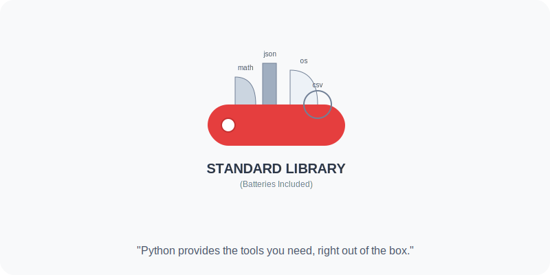

# Bab 09: Batteries-included Mindset

Chapter Code: CORE-04-09
Version: Core.Fundamentals.04.01
Last Updated: 2026-03-15
Status: Published

> **Deskripsi Singkat**: Mengenal filosofi "Batteries Included" yang membuat Python sangat produktif: Anda dibekali dengan modul-modul bawaan yang sangat kuat sehingga bisa langsung bekerja tanpa harus mencari alat di tempat lain.

## 1. Analogi (Pendekatan Konsep)

### Analogi Singkat
> "Mindset *Batteries Included* itu seperti membeli sebuah **Kotak Perkakas Swiss (Swiss Army Knife)**. Saat Anda membeli pisau lipat ini, Anda sudah mendapatkan gunting, obeng, dan pembuka botol di dalamnya. Anda tidak perlu pergi ke toko bangunan setiap kali ingin mengencangkan baut kecil."

### Analogi Panjang (Rumah Siap Huni vs Kavling Tanah)
Bayangkan Anda ingin pindah rumah.

Bahasa lain mungkin seperti **Kavling Tanah**. Anda diberi tanah yang bagus, tapi Anda harus membangun rumah, memasang kabel listrik, sampai membeli kompor sendiri sebelum bisa memasak. Ini sangat fleksibel, tapi butuh waktu lama untuk mulai hidup.

Python seperti **Rumah Siap Huni (Fully Furnished)**. Begitu Anda masuk, kasurnya sudah ada, kompornya sudah siap, bahkan lampunya sudah terpasang. Anda bisa langsung "memasak" program Anda sejak hari pertama. Jika nanti Anda butuh alat masak yang sangat spesifik (misal *Air Fryer* canggih), barulah Anda membelinya di luar (Third-party library).

Inilah filosofi Python: menyediakan segala sesuatu yang fundamental secara gratis dan siap pakai di dalam **Standard Library**.

## 2. Istilah Kunci (Key Terms)

| Istilah | Definisi Singkat | Contoh |
|---|---|---|
| Batteries Included | Filosofi menyediakan alat bawaan yang lengkap | Modul `json`, `math`, `datetime` |
| Standard Library | Kumpulan modul resmi yang datang bersama instalasi Python | `pathlib`, `collections`, `itertools` |
| Third-party Package | Library buatan komunitas di luar instalasi resmi | `requests`, `pandas`, `django` |
| PyPI | Tempat berkumpulnya ribuan library pihak ketiga | - |
| Dependency | Library luar yang dibutuhkan agar program Anda bisa jalan | Paket di file `requirements.txt` |

## 3. Konsep Utama

### A. Mulai dari yang Sudah Ada
Sebelum Anda memutuskan untuk menginstal library baru (misal lewat `pip install`), tanyakan dulu: "Apakah Python sudah punya solusinya?". Sering kali, masalah Anda (seperti mengolah file CSV, mengirim email, atau menghitung statistik) sudah ada solusinya di Standard Library.

### B. Kekuatan Standard Library
Modul bawaan Python didesain oleh para ahli dan telah diuji oleh jutaan orang selama puluhan tahun. Mereka stabil, terdokumentasi dengan sangat baik, dan dijamin akan tetap ada di versi Python berikutnya.

### C. Keamanan & Stabilitas
Menggunakan library bawaan jauh lebih aman daripada menginstal library dari internet yang mungkin memiliki celah keamanan atau tiba-tiba tidak dirawat lagi oleh pembuatnya. Standard Library adalah pilihan yang paling "tahan lama" untuk proyek jangka panjang.

### D. Kapan Pakai Pihak Ketiga (PyPI)?
Gunakan library luar hanya jika kebutuhan Anda sangat spesifik (seperti Data Science yang butuh `NumPy`) atau jika library luar tersebut memberikan kemudahan penggunaan yang jauh lebih baik (seperti `Requests` untuk urusan HTTP).

## 4. Visualisasi Analogi

## 5. Peringatan / Jebakan Umum (Gotchas)

- **Membangun Roda Kembali**: Programmer sering menghabiskan waktu berjam-jam membuat fungsi untuk memanipulasi list, padahal modul `itertools` bisa menyelesaikannya dalam satu baris. Cek dulu kamus Standard Library!
- **Dependency Hell**: Terlalu banyak menggunakan library luar akan membuat program Anda berat dan sulit diperbarui (update). Jaga agar daftar *dependency* Anda tetap minimal dan esensial.
- **Lupa Cek Library Bawaan**: Banyak library besar sebenarnya hanya membungkus Standard Library dengan cara yang sedikit lebih cantik. Pastikan Anda tahu apa yang terjadi "di bawah kap mobil".

## 6. Referensi Kode Praktik

Buka folder `examples/` untuk melihat penerapan langsung:
- `01_stdlib_efficiency.py`: Menyelesaikan masalah kompleks hanya dengan modul bawaan.
- `02_compare_external.py`: Kapan kita harus menyerah pada Standard Library dan beralih ke library luar.

## 7. Latihan (Validasi)

- [ ] Cobalah parsing sebuah file JSON menggunakan modul `json` bawaan tanpa menginstal library tambahan.
- [ ] Eksplorasi modul `collections` dan temukan apa kegunaan dari `Counter`.
- [ ] Sebutkan 3 library pihak ketiga yang paling sering Anda gunakan, dan cari tahu apakah ada modul di Standard Library yang memiliki fungsi serupa (walaupun lebih sederhana).
