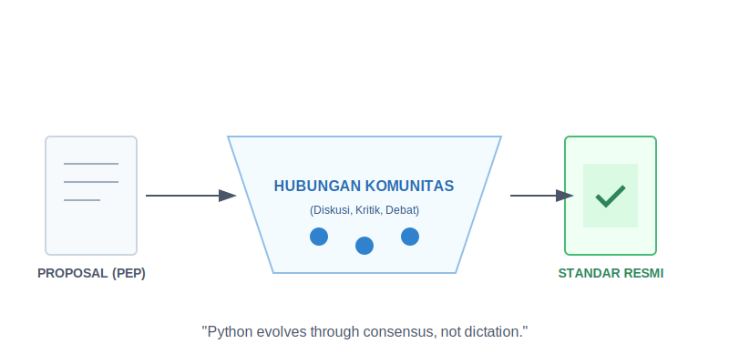

# Bab 10: Backward Compatibility and PEPs

Chapter Code: CORE-04-10
Version: Core.Fundamentals.04.01
Last Updated: 2026-03-15
Status: Published

> **Deskripsi Singkat**: Memahami bagaimana Python berevolusi tanpa merusak kode lama (Backward Compatibility) dan bagaimana setiap ide baru diperjuangkan melalui dokumen resmi yang disebut PEP.

## 1. Analogi (Pendekatan Konsep)

### Analogi Singkat
> "Backward Compatibility itu seperti **Renovasi Gedung Tua**—Anda boleh menambah lift dan AC modern, tapi Anda harus menjamin tiang penyangga aslinya tetap kuat agar gedung tidak roboh bagi penghuni lama."

### Analogi Panjang (Sidang Parlemen & Undang-Undang)
Bayangkan Python adalah sebuah negara. Bagaimana sebuah undang-undang baru dibuat agar tidak menimbulkan kekacauan bagi rakyatnya?

Setiap warga (Programmer) yang punya ide hebat untuk kemajuan negara harus mengajukan **Draft Undang-Undang (PEP - Python Enhancement Proposal)**. Ide tersebut tidak langsung disahkan, melainkan harus melewati **Sidang Parlemen (Diskusi Komunitas)**.

Para ahli akan menguji: "Apakah ide ini akan membuat rakyat bingung?", "Apakah peraturan lama jadi tidak berlaku secara mendadak?". Jika ide tersebut disetujui oleh ** Steering Council (Dewan Pimpinan)**, barulah ia menjadi hukum resmi negara Python.

Proses yang matang ini memastikan bahwa kode yang Anda tulis hari ini masih bisa berjalan 5 atau 10 tahun lagi, meskipun Python terus bertambah canggih.

## 2. Istilah Kunci (Key Terms)

| Istilah | Definisi Singkat | Contoh |
|---|---|---|
| PEP | Dokumen proposal resmi untuk perubahan fitur Python | PEP 8 (Style Guide) |
| Backward Compatibility | Kemampuan versi baru untuk menjalankan kode dari versi lama | Kode Python 3.10 jalan di 3.12 |
| Deprecation | Masa transisi di mana sebuah fitur lama mulai dilarang | Munculnya `DeprecationWarning` |
| Steering Council | Kelompok kecil orang yang punya kata akhir tentang arah Python | - |
| Breaking Change | Perubahan yang membuat kode lama berhenti berfungsi | Menghapus fungsi tanpa pemberitahuan |

## 3. Konsep Utama

### A. Keseimbangan Antara Stabilitas dan Kemajuan
Python sangat menjaga kepercayaan penggunanya. Mereka tidak akan mengubah hal-hal mendasar secara tiba-tiba hanya karena ada tren baru. Stabilitas adalah prioritas, namun kemajuan tetap berjalan lewat diskusi yang transparan.

### B. PEP: Jantung Inovasi Python
Setiap fitur besar di Python (seperti `async/await` atau `Type Hints`) selalu berawal dari sebuah PEP. Membaca PEP bukan hanya untuk ahli, tapi bagi siapa pun yang ingin tahu "mengapa" sebuah fitur didesain seperti itu.

### C. Masa Transisi (Deprecation Period)
Saat sebuah fungsi lama ingin diganti dengan yang lebih baik, Python tidak langsung menghapusnya. Ada masa "Deprecation" (biasanya selama beberapa versi rilis) di mana programmer diberi peringatan agar segera beralih ke cara baru sebelum cara lama benar-benar dihapus.

### D. Keputusan Berbasis Komunitas
Python tidak dimiliki oleh satu perusahaan. Keputusan arah bahasa ini diambil berdasarkan konsensus komunitas. Ini menjamin bahwa Python tetap relevan dengan kebutuhan programmer di seluruh dunia.

## 4. Visualisasi Analogi

## 5. Peringatan / Jebakan Umum (Gotchas)

- **Mengubah Sintaks Secara Tiba-tiba**: Jangan pernah mengubah cara kerja fungsi di proyek tim Anda tanpa memberitahu orang lain atau memberikan masa transisi. Ini adalah resep pasti untuk kekacauan saat *deployment*.
- **Lupa Membaca PEP 0**: PEP 0 adalah indeks dari semua PEP yang ada. Jika Anda ingin tahu standar terbaru tentang sesuatu, mulailah dari sana.
- **Kekakuan vs Kekacauan**: Jangan terlalu kaku menolak perubahan (anti-kemajuan), tapi juga jangan terlalu cepat mengganti segala sesuatu (anti-stabilitas). Temukan jalan tengah yang aman.

## 6. Referensi Kode Praktik

Buka folder `examples/` untuk melihat penerapan langsung:
- `01_deprecation_warning.py`: Cara memberikan peringatan yang sopan kepada pengguna kode Anda sebelum menghapus fitur.
- `02_api_evolution.py`: Contoh mengelola dua versi API secara bersamaan selama masa transisi.

## 7. Latihan (Validasi)

- [ ] Cari tahu apa isi dari **PEP 8** dan **PEP 20**, lalu jelaskan pengaruhnya pada gaya coding Anda saat ini.
- [ ] Buatlah sebuah fungsi sederhana dan berikan `DeprecationWarning` jika fungsi tersebut dipanggil.
- [ ] Temukan satu fitur di Python versi terbaru yang sangat Anda sukai, lalu cari nomor PEP-nya dan bacalah bagian "Motivation" (alasan dibuatnya fitur tersebut).
