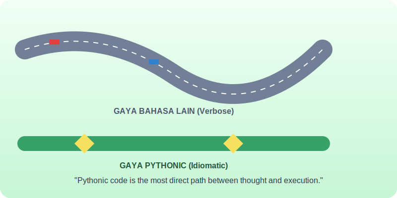

# Bab 11: Idiomatic Python and Style

Chapter Code: CORE-04-11
Version: Core.Fundamentals.04.01
Last Updated: 2026-03-15
Status: Published

> **Deskripsi Singkat**: Belajar "berbicara" dalam bahasa Python yang fasih (Idiomatic), bukan sekadar menerjemahkan logika dari bahasa lain ke dalam sintaks Python.

## 1. Analogi (Pendekatan Konsep)

### Analogi Singkat
> "Bahasa Python yang idiomatik (Pythonic) itu seperti **Bahasa Gaul di Kalangan Profesional**. Jika Anda menggunakannya dengan benar, orang lain akan langsung tahu bahwa Anda adalah 'orang dalam' yang paham budaya setempat, dan komunikasi pun menjadi jauh lebih cepat serta efisien."

### Analogi Panjang (Jalan Raya vs Jalan Pintas Resmi)
Bayangkan Anda sedang menuju ke pusat kota.

Ada **Jalan Raya Besar** yang memutar, penuh lampu merah, dan melelahkan (ini seperti menulis gaya Java atau C di dalam Python). Anda tetap sampai tujuan, tapi dengan tenaga dan waktu yang terbuang banyak.

Lalu ada **Jalan Pintas Resmi** yang indah, asri, dan memang disediakan oleh tata kota untuk pejalan kaki (ini adalah gaya Pythonic). Jalannya lurus, efisien, dan menyenangkan untuk dilewati.

Menjadi "Pythonic" bukan berarti Anda melakukan trik-trik yang aneh. Sebaliknya, Anda menggunakan alat-alat yang memang sudah disediakan oleh Python (seperti *List Comprehension*, *Unpacking*, atau *Context Managers*) untuk memotong jalur yang bertele-tele menjadi kode yang elegan dan bercerita.

## 2. Istilah Kunci (Key Terms)

| Istilah | Definisi Singkat | Contoh |
|---|---|---|
| Pythonic | Gaya penulisan yang mengikuti budaya dan standar Python | Menggunakan `with open(...)` |
| Idiomatic | Pola ekspresi yang natural bagi sebuah bahasa | `a, b = b, a` untuk swap |
| PEP 8 | Standar resmi panduan gaya penulisan kode Python | Aturan indentasi 4 spasi |
| Linter | Alat otomatis untuk mengecek kesalahan gaya/sintaks | Flake8, Pylint, Ruff |
| Anti-pattern | Cara penyelesaian masalah yang terlihat benar tapi berdampak buruk | `except: pass` |

## 3. Konsep Utama

### A. "The One Obvious Way"
Filosofi Python adalah: *"There should be one-- and preferably only one --obvious way to do it"*. Python lebih suka satu cara yang jelas dan standar daripada menyediakan 10 cara berbeda yang membingungkan. Tugas Anda adalah menemukan "cara yang satu" itu.

### B. Menulis Kode yang Bercerita
Kode Pythonic harus terasa seperti membaca paragraf bahasa Inggris. Gunakan penamaan yang logis, alur yang linear, dan hindari simbol-simbol aneh yang tidak perlu. Kode Anda harus menjelaskan **APA** yang sedang terjadi tanpa butuh banyak komentar.

### C. Standar PEP 8
Ini adalah "Undang-Undang Kesopanan" di Python. Mulai dari berapa spasi untuk indentasi hingga bagaimana cara memberi nama Class (`PascalCase`) dan Fungsi (`snake_case`). Mengikuti PEP 8 membuat kode Anda terlihat profesional di mata dunia.

### D. Alat Bantu (Linters & Formatters)
Jangan mencoba menghafal semua aturan style. Gunakan bantuan alat seperti **Black** (untuk merapikan kode otomatis) atau **Ruff** (untuk mengecek kesalahan gaya). Biarkan mesin yang mengerjakan urusan kosmetik, sementara Anda fokus pada logika bisnis.

## 4. Visualisasi Analogi

## 5. Peringatan / Jebakan Umum (Gotchas)

- **Diktator Style**: Jangan berdebat berjam-jam tentang spasi atau tanda kurung. Gunakan satu standar (misal Black) dan ikuti saja. Konsistensi jauh lebih penting daripada preferensi pribadi.
- **Terlalu Pintar (Yoda Code)**: Hati-hati dengan *List Comprehension* yang terlalu panjang dan rumit. Jika satu baris kode Anda terlihat seperti rumus fisika kuantum, pecahlah menjadi loop `for` biasa.
- **Mengabaikan Konsistensi Tim**: Jika tim Anda sudah punya standar sendiri yang sedikit berbeda dari PEP 8, ikutilah standar tim tersebut. Menghormati "budaya lokal" adalah bagian dari menjadi profesional.

## 6. Referensi Kode Praktik

Buka folder `examples/` untuk melihat penerapan langsung:
- `01_pythonic_tricks.py`: Kumpulan "Jalan Pintas" resmi yang membuat kode jauh lebih bersih.
- `02_pep8_makeover.py`: Transformasi kode berantakan menjadi kode standar industri.

## 7. Latihan (Validasi)

- [ ] Cobalah instal alat **Black** atau **Ruff** dan jalankan pada salah satu file Python lama Anda. Lihat seberapa banyak perubahan yang disarankan.
- [ ] Ubahlah sebuah loop `for` sederhana yang hanya melakukan filter data menjadi sebuah *List Comprehension*.
- [ ] Lakukan "Swap" (tukar posisi) dua variable tanpa membuat variable bantuan `temp`, menggunakan gaya Pythonic.
