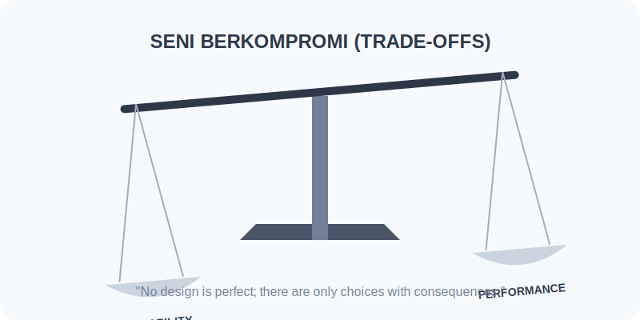

# Language Design Tradeoffs

Chapter Code: CORE-04-12
Book Code: CORE-04
Version: Core.Fundamentals.04.00
Last Updated: 2026-03-14
Status: Draft
Difficulty: Intermediate
Estimated Time: 50 menit teori + 40 menit praktik

## Bab Ini Tentang Apa

Bab ini merangkum trade-off utama yang membentuk Python: readability vs verbosity, dynamism vs safety, convenience vs performance, dan compatibility vs progress. Fokus bab ini bukan menghafal aturan, tetapi melatih pola pikir "tidak ada desain gratis" saat menulis kode.

## Prasyarat Spesifik Bab

- sudah membaca CORE-04-01 sampai CORE-04-11
- memahami fungsi, class, exception, dan module dasar
- nyaman membaca contoh kode Python tingkat pemula-menengah

## Istilah Kunci

| Istilah | Definisi Singkat | Contoh |
|---|---|---|
| trade-off | kompromi antar dua nilai desain yang sama-sama penting | readability vs compactness |
| ergonomics | kemudahan penggunaan fitur untuk developer | list/dict comprehension |
| explicitness | niat program ditulis jelas di kode | named argument, guard clause |
| consistency | pola yang seragam antar fitur | `for ... in ...`, iterator protocol |
| backward compatibility | kompatibilitas terhadap kode lama | deprecation period sebelum breaking |

## Tujuan Besar

Membantu pembaca mengambil keputusan teknis yang seimbang, bukan fanatik pada satu prinsip tunggal.

## Tujuan Kecil

- mengenali trade-off dominan pada Python
- memilih solusi berdasarkan konteks tim/proyek
- menjelaskan alasan desain yang dipilih secara objektif

## Hasil Belajar

Setelah menyelesaikan bab ini, pembaca diharapkan mampu:

- mengidentifikasi minimal 4 trade-off desain Python
- membandingkan 2 pendekatan implementasi dengan kriteria jelas
- menulis kode yang lebih mudah dirawat tanpa over-engineering

## Peruntukan

Bab ini digunakan saat:

- melakukan code review dan perlu argumen teknis yang kuat
- menentukan style/pattern di project Python
- menimbang performa, keterbacaan, dan kompatibilitas

## Bukan Peruntukan

Bab ini bukan untuk:

- analisis mikro-optimisasi level C extension
- pembahasan compiler theory atau VM internals mendalam
- pembenaran "satu gaya paling benar untuk semua kasus"

## Analogi

Anggap desain bahasa seperti desain transportasi kota. Jalan lebar memudahkan mobil (ergonomics) tapi bisa memperumit pejalan kaki (safety/readability). Tidak ada kota yang maksimal di semua dimensi sekaligus.

## Miskonsepsi Umum

- Miskonsepsi: "Kalau idiomatic, pasti terbaik."
  Klarifikasi: idiomatic biasanya baseline baik, tapi konteks performa/keamanan bisa meminta pendekatan lain.

- Miskonsepsi: "Kode paling singkat selalu paling Pythonic."
  Klarifikasi: Pythonic menekankan kejelasan intent, bukan sekadar minim karakter.

- Miskonsepsi: "Dynamic typing berarti tidak butuh desain API."
  Klarifikasi: karena lebih dinamis, kontrak API dan error message justru harus lebih disiplin.

## Konsep Inti

### 1. Prinsip Dasar

Trade-off inti Python bisa diringkas jadi empat poros:

1. Readability vs Compactness
Python memilih syntax yang cenderung mudah dibaca manusia, walau kadang lebih panjang.

2. Flexibility vs Safety
Dynamic typing memberi kebebasan bergerak cepat, tetapi risiko bug tipe berpindah ke runtime jika tanpa test/type checker.

3. Convenience vs Performance
Banyak API bawaan nyaman dipakai. Untuk beban besar, kenyamanan ini kadang perlu ditukar dengan kontrol performa yang lebih rendah-level.

4. Stability vs Evolution
Ekosistem Python besar, jadi perubahan perlu bertahap agar tidak mematahkan terlalu banyak kode lama.

### 2. Dampak Praktis

Dalam coding harian, dampaknya biasanya muncul di titik berikut:

- desain function signature: lebih explicit dengan named parameter dan default yang aman
- penggunaan one-liner: pakai hanya jika intent tetap langsung terbaca
- error handling: fail loudly dengan pesan yang membantu, bukan menutup error diam-diam
- compatibility: saat ubah API, sediakan masa transisi/deprecation sebelum memutus

Pola praktis yang sehat:

1. pilih implementasi paling jelas terlebih dahulu
2. ukur bottleneck nyata
3. optimasi titik sempit saja
4. dokumentasikan trade-off yang diambil

## Diagram



Caption: Diagram menunjukkan bahwa setiap keputusan desain bergerak di antara dua nilai yang sama-sama valid.

### Legenda Diagram

- 1??: kebutuhan produk/tim
- 2??: analisis trade-off per opsi
- 3??: keputusan implementasi + konsekuensinya

## Contoh Kode (Benar)

```python
from typing import Iterable


def average(scores: Iterable[float]) -> float:
    values = list(scores)
    if not values:
        raise ValueError("scores must not be empty")
    return sum(values) / len(values)


print(average([80, 90, 100]))
```

Expected output:

```text
90.0
```

## Pitfall Umum

Contoh kesalahan yang sering terjadi:

```python
def average(scores):
    # trade-off buruk: terlalu permisif dan menyembunyikan error
    try:
        return sum(scores) / len(scores)
    except Exception:
        return 0
```

Perbaikan:

```python
from typing import Iterable


def average(scores: Iterable[float]) -> float:
    values = list(scores)
    if not values:
        raise ValueError("scores must not be empty")
    return sum(values) / len(values)
```

## Catatan Praktis

- jangan optimasi sebelum punya data profiling
- type hint membantu komunikasi intent, walau Python tetap dinamis
- exception message adalah bagian dari desain API
- saat membuat helper util, utamakan nama yang jelas dibanding "terlihat pintar"
- di code review, nilai keputusan dengan kriteria: readability, reliability, compatibility, performance

## Latihan

### Dasar

Sebutkan satu trade-off dari fungsi `average` versi final dan jelaskan kenapa dipilih.

### Menengah

Buat dua versi fungsi parsing angka dari string:
1. versi ringkas (sedikit baris)
2. versi eksplisit (lebih banyak validasi)
Bandingkan kapan masing-masing lebih cocok.

### Mini Challenge

Buat modul mini `pricing.py` berisi fungsi diskon. Tambahkan:
- validasi input
- error message yang jelas
- minimal 3 test case

Lalu tulis 5-8 kalimat tentang trade-off yang kamu ambil (kemudahan pakai vs ketegasan validasi).

## Checklist Lulus Bab

- [ ] bisa menyebut 4 poros trade-off utama Python
- [ ] mampu memberi alasan desain untuk satu keputusan API
- [ ] menyelesaikan mini challenge dengan test yang lolos
- [ ] dapat membedakan kapan perlu eksplisit vs ringkas

## Peta Keterkaitan

- Bab sebelumnya: 11_idiomatic_python_and_style.md
- Bab berikutnya: tidak ada (bab penutup book 04)
- Keterkaitan lintas buku Core: CORE-01, CORE-02, CORE-03

## Ringkasan

- desain bahasa Python adalah rangkaian kompromi, bukan daftar aturan mutlak
- keputusan engineering terbaik bergantung konteks, bukan slogan
- readability, safety, performance, dan compatibility harus dinilai bersama
- dokumentasi alasan desain mempercepat maintenance jangka panjang

## FAQ Singkat

1. Apakah semua fungsi perlu type hint?
   Jawaban singkat: tidak wajib, tapi sangat membantu API publik dan kolaborasi tim.
2. Kapan one-liner masih layak dipakai?
   Jawaban singkat: saat intent tetap langsung terbaca tanpa parsing mental berat.
3. Mana lebih penting: backward compatibility atau clean design?
   Jawaban singkat: untuk sistem produksi besar, biasanya kompatibilitas menang; clean design dilakukan bertahap lewat deprecation.
4. Bagaimana tahu trade-off saya tepat?
   Jawaban singkat: tetapkan kriteria, ukur dampak, dan validasi lewat review + test.

## Referensi

- Python Tutorial: https://docs.python.org/3/tutorial/
- Python Language Reference: https://docs.python.org/3/reference/
- PEP 8 (Style Guide): https://peps.python.org/pep-0008/
- PEP 20 (Zen of Python): https://peps.python.org/pep-0020/
- PEP Index: https://peps.python.org/
