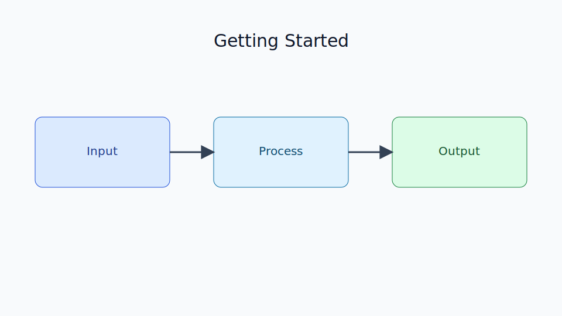

# Getting Started

Chapter Code: CORE-01-01
Book Code: CORE-01
Version: v0.2.0
Last Updated: 2026-03-08
Status: In Progress
Difficulty: Basic
Estimated Time: 25 menit teori + 20 menit praktik

## Bab Ini Tentang Apa

Bab ini adalah pintu masuk untuk mulai belajar Python secara benar. Fokusnya bukan hanya menjalankan kode pertama, tetapi memahami alur kerja dasar: menyiapkan Python, menjalankan script, membaca output, dan mengenali error awal. Setelah bab ini, pembaca punya fondasi praktik yang stabil untuk mengikuti bab berikutnya.

## Prasyarat Spesifik Bab

- dapat menggunakan terminal/command prompt dasar
- sudah menginstal Python 3.x di sistem
- mengetahui cara membuat file teks `.py`

## Istilah Kunci

| Istilah | Definisi Singkat | Contoh |
|---|---|---|
| interpreter | program yang mengeksekusi kode Python | `python script.py` |
| REPL | mode interaktif Python baris per baris | `python` lalu `>>>` |
| script | file berisi kode Python | `hello.py` |
| runtime error | error saat program dijalankan | `NameError` |

## Tujuan Besar

Membentuk kebiasaan awal yang benar saat memulai Python: setup yang rapi, eksekusi terukur, dan debugging dasar.

## Tujuan Kecil

- memahami cara cek instalasi Python
- menjalankan kode di REPL dan file `.py`
- membaca output dan pesan error sederhana
- memahami perbedaan REPL vs script

## Peruntukan

Bab ini digunakan saat:

- baru pertama belajar Python
- berpindah dari bahasa lain dan ingin menyamakan workflow dasar
- menyiapkan lingkungan latihan Python yang konsisten

## Bukan Peruntukan

Bab ini bukan untuk:

- pembahasan performa Python tingkat lanjut
- desain arsitektur aplikasi besar

## Analogi

Mulai belajar Python seperti belajar mengemudi: sebelum bahas teknik lanjutan, kamu harus tahu cara menyalakan mesin, menjalankan mobil, dan membaca indikator di dashboard.

## Miskonsepsi Umum

- Miskonsepsi: kalau Python terinstal, semua langsung siap.
  Klarifikasi: tetap perlu verifikasi versi, path, dan cara eksekusi script.

- Miskonsepsi: REPL dan file script itu sama persis.
  Klarifikasi: REPL bagus untuk eksperimen cepat, script untuk kode terstruktur dan dapat diulang.

## Konsep Inti

### 1. Verifikasi Instalasi Python

Pastikan Python dapat dipanggil dari terminal:

```bash
python --version
```

Jika lingkungan memakai `python3`, gunakan:

```bash
python3 --version
```

### 2. Menjalankan Kode dengan Dua Cara

Cara 1, REPL:

```bash
python
```

Lalu ketik:

```python
print("Hello from REPL")
```

Cara 2, script file:

```python
# hello.py
print("Hello from script")
```

Jalankan dengan:

```bash
python hello.py
```

## Diagram



Caption: Diagram menunjukkan alur input, proses interpretasi, dan output saat menjalankan kode Python pertama.

### Legenda Diagram

- kotak biru: input kode
- kotak tengah: proses interpretasi
- kotak hijau: output/error

## Contoh Kode (Benar)

```python
name = "Python"
print(f"Hello, {name}!")
```

Expected output:

```text
Hello, Python!
```

## Pitfall Umum

Contoh kesalahan yang sering terjadi:

```python
if True
    print("missing colon")
```

Perbaikan:

```python
if True:
    print("colon fixed")
```

## Catatan Praktis

- mulai dari script kecil, lalu naikkan kompleksitas bertahap
- baca pesan error dari baris pertama sampai akhir
- gunakan nama file sederhana (`hello.py`, `main.py`) saat latihan awal

## Latihan

### Dasar

Buat file `intro.py` yang mencetak nama kamu dan versi Python yang dipakai.

### Menengah

Jalankan kode yang sama di REPL dan di file script, lalu catat perbedaannya.

### Mini Challenge

Buat script yang menerima input nama dari pengguna lalu menampilkan sapaan personal.

## Checklist Lulus Bab

- [ ] berhasil cek versi Python dari terminal
- [ ] berhasil menjalankan kode lewat REPL
- [ ] berhasil menjalankan file `.py`
- [ ] memahami error dasar dan perbaikannya

## Peta Keterkaitan

- Bab sebelumnya: tidak ada (bab pembuka)
- Bab berikutnya: `02_python_syntax.md`
- Keterkaitan lintas buku Core: `CORE-03` (Execution Model)

## Ringkasan

- Getting Started menetapkan workflow awal Python yang benar.
- REPL cocok untuk eksperimen cepat, script cocok untuk latihan terstruktur.
- Kemampuan membaca error dasar sangat penting sejak awal.

## FAQ Singkat

1. Harus pakai REPL atau script dulu?
   Jawaban singkat: mulai dari REPL untuk eksplorasi cepat, lanjut ke script untuk latihan serius.
2. Kalau `python --version` gagal, apa yang dicek dulu?
   Jawaban singkat: cek instalasi Python dan konfigurasi PATH.
3. Kenapa error message penting dibaca detail?
   Jawaban singkat: karena pesan error menunjukkan lokasi dan jenis masalah secara langsung.

## Referensi

- Python Official Documentation: https://docs.python.org/3/
- Python Tutorial: https://docs.python.org/3/tutorial/
- Python Language Reference: https://docs.python.org/3/reference/
