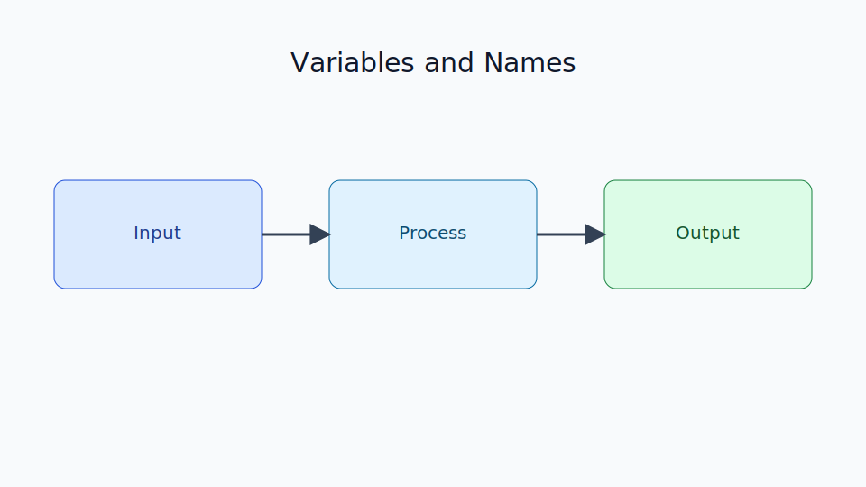

# Variables and Names

Chapter Code: CORE-01-03
Book Code: CORE-01
Version: v0.2.3
Last Updated: 2026-03-08
Status: In Progress
Difficulty: Basic
Estimated Time: 35 menit teori + 30 menit praktik

## Bab Ini Tentang Apa

Bab ini membahas konsep penting bahwa di Python, variabel adalah nama (name) yang terikat ke objek, bukan kotak memori yang menyimpan nilai secara langsung. Topik ini penting untuk memahami assignment, perubahan nilai, aliasing, dan perilaku mutable vs immutable.

## Prasyarat Spesifik Bab

- memahami `01_getting_started.md`
- memahami sintaks dasar dari `02_python_syntax.md`
- dapat menjalankan contoh kode sederhana

## Istilah Kunci

| Istilah | Definisi Singkat | Contoh |
|---|---|---|
| name binding | proses mengaitkan nama ke objek | `x = 10` |
| assignment | operasi memberi nama ke objek | `user = "Ana"` |
| mutable | objek bisa diubah tanpa buat objek baru | `list`, `dict` |
| immutable | objek tidak bisa diubah in-place | `int`, `str`, `tuple` |
| aliasing | dua nama menunjuk objek sama | `a = b` |

## Tujuan Besar

Membantu pembaca memahami model objek Python sejak awal agar terhindar dari kesalahan logika saat memanipulasi data.

## Tujuan Kecil

- memahami bahwa variabel adalah referensi nama ke objek
- membedakan assignment dan copy
- memahami dampak mutable vs immutable
- mengenali masalah aliasing sederhana

## Peruntukan

Bab ini digunakan saat:

- mulai bekerja dengan data yang sering berubah
- bingung kenapa perubahan list di satu variabel memengaruhi variabel lain
- ingin memahami perilaku assignment Python secara benar

## Bukan Peruntukan

Bab ini bukan untuk:

- pembahasan detail memory management tingkat lanjut
- optimasi objek tingkat CPython internal

## Analogi

Nama variabel seperti label pada kotak barang di gudang. Label bisa dipindah ke kotak lain. Dua label juga bisa menempel ke kotak yang sama.

## Miskonsepsi Umum

- Miskonsepsi: variabel menyimpan nilai langsung.
  Klarifikasi: variabel adalah nama yang mereferensi objek.

- Miskonsepsi: `a = b` selalu membuat salinan baru.
  Klarifikasi: `a = b` membuat `a` dan `b` menunjuk objek yang sama (alias), kecuali kita copy eksplisit.

## Konsep Inti

### 1. Assignment adalah Name Binding

```python
x = 10
y = x
print(x, y)
```

`x` dan `y` mereferensi objek integer yang sama pada saat assignment.

### 2. Mutable vs Immutable

Objek immutable menghasilkan objek baru saat "diubah":

```python
name = "Ana"
name = name + " Maria"
print(name)
```

Objek mutable bisa diubah in-place:

```python
items = [1, 2]
items.append(3)
print(items)
```

### 3. Aliasing dan Efek Samping

```python
a = [1, 2]
b = a
b.append(3)
print(a)  # ikut berubah
print(b)
```

Untuk menghindari aliasing:

```python
a = [1, 2]
b = a.copy()
b.append(3)
print(a)  # tetap
print(b)
```

## Diagram



Caption: Diagram menunjukkan relasi antara nama variabel, objek, dan efek assignment terhadap mutable/immutable.

### Legenda Diagram

- kotak biru: nama variabel
- kotak tengah: objek di memori
- panah: referensi nama ke objek

## Contoh Kode (Benar)

```python
user_name = "Rina"
score = 100
print(user_name, score)
```

Expected output:

```text
Rina 100
```

## Pitfall Umum

Contoh aliasing yang tidak disengaja:

```python
list_a = [1, 2, 3]
list_b = list_a
list_b.append(4)
print(list_a)
```

Perbaikan dengan copy:

```python
list_a = [1, 2, 3]
list_b = list_a.copy()
list_b.append(4)
print(list_a)
print(list_b)
```

## Catatan Praktis

- gunakan nama variabel deskriptif (`total_price`, `user_name`)
- hindari nama ambigu seperti `x`, `data1` untuk kode produksi
- saat bekerja dengan list/dict, cek apakah butuh alias atau copy

## Latihan

### Dasar

Buat 3 variabel berbeda tipe (`int`, `str`, `list`) lalu tampilkan nilainya.

### Menengah

Buktikan perbedaan alias dan copy menggunakan list.

### Mini Challenge

Buat program kecil yang menyimpan profil pengguna dalam dictionary, lalu ubah data pada salinan dictionary tanpa mengubah data awal.

## Checklist Lulus Bab

- [ ] memahami konsep name binding
- [ ] bisa membedakan mutable dan immutable
- [ ] bisa menjelaskan efek aliasing
- [ ] menyelesaikan mini challenge

## Peta Keterkaitan

- Bab sebelumnya: `02_python_syntax.md`
- Bab berikutnya: `04_basic_data_types.md`
- Keterkaitan lintas buku Core: `CORE-04` (Object Model)

## Ringkasan

- Variabel di Python adalah nama yang menunjuk objek.
- Assignment tidak selalu berarti membuat salinan baru.
- Memahami mutable vs immutable penting untuk menghindari bug data.

## FAQ Singkat

1. Apakah `a = b` menyalin data?
   Jawaban singkat: tidak, biasanya hanya menyalin referensi nama.
2. Kapan harus pakai `.copy()`?
   Jawaban singkat: saat ingin data baru yang terpisah dari objek asli.
3. Kenapa string terlihat "berubah" saat ditambah?
   Jawaban singkat: karena operasi membuat objek string baru.

## Referensi

- Python Tutorial (Data Structures): https://docs.python.org/3/tutorial/datastructures.html
- Python Data Model: https://docs.python.org/3/reference/datamodel.html
- Python Standard Types: https://docs.python.org/3/library/stdtypes.html
