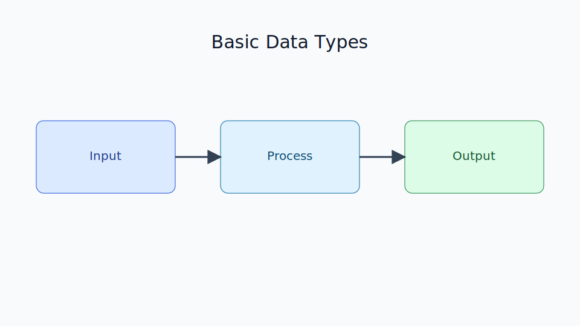

# Basic Data Types

Chapter Code: CORE-01-04
Book Code: CORE-01
Version: v0.2.4
Last Updated: 2026-03-08
Status: In Progress
Difficulty: Basic
Estimated Time: 40 menit teori + 35 menit praktik

## Bab Ini Tentang Apa

Bab ini membahas tipe data dasar di Python: `int`, `float`, `bool`, `str`, dan `NoneType`. Pembaca akan memahami kapan tiap tipe digunakan, bagaimana konversi tipe bekerja, serta efek tipe data terhadap hasil operasi.

## Prasyarat Spesifik Bab

- memahami `01_getting_started.md`
- memahami `02_python_syntax.md`
- memahami konsep name binding dari `03_variables_and_names.md`

## Istilah Kunci

| Istilah | Definisi Singkat | Contoh |
|---|---|---|
| int | bilangan bulat | `10`, `-3` |
| float | bilangan pecahan | `3.14`, `-0.5` |
| bool | nilai logika benar/salah | `True`, `False` |
| str | teks/karakter | `"Python"` |
| None | nilai kosong/ketiadaan nilai | `None` |
| type casting | konversi tipe data | `int("12")` |

## Tujuan Besar

Membekali pembaca kemampuan memilih dan menggunakan tipe data yang tepat untuk kebutuhan program dasar.

## Tujuan Kecil

- mengenali tipe data dasar Python
- menggunakan `type()` untuk inspeksi tipe
- melakukan konversi tipe dengan aman
- memahami truthiness dasar pada kondisi

## Peruntukan

Bab ini digunakan saat:

- mulai membangun logika program sederhana
- memproses input pengguna
- menangani perhitungan dan teks dalam satu alur program

## Bukan Peruntukan

Bab ini bukan untuk:

- pembahasan struktur data lanjutan
- pembahasan numerik presisi tinggi mendalam

## Analogi

Tipe data seperti jenis wadah: botol untuk cairan, kotak untuk barang, amplop untuk surat. Isi berbeda butuh wadah yang tepat.

## Miskonsepsi Umum

- Miskonsepsi: semua angka di Python sama.
  Klarifikasi: `int` dan `float` punya perilaku berbeda dalam operasi tertentu.

- Miskonsepsi: `"10"` sama dengan `10`.
  Klarifikasi: yang pertama `str`, yang kedua `int`; hasil operasi bisa berbeda.

## Konsep Inti

### 1. Tipe Data Dasar dan Pemeriksaannya

```python
age = 21
price = 19.99
is_active = True
name = "Rina"
value = None

print(type(age), type(price), type(is_active), type(name), type(value))
```

### 2. Type Casting

```python
raw_age = "18"
age = int(raw_age)
ratio = float("3.5")
text = str(100)

print(age + 2)
print(ratio * 2)
print("ID-" + text)
```

### 3. Truthiness Dasar

```python
print(bool(0))      # False
print(bool(1))      # True
print(bool(""))     # False
print(bool("ok"))   # True
print(bool([]))     # False
print(bool([1]))    # True
```

## Diagram



Caption: Diagram menunjukkan relasi tipe data dasar, operasi umum, dan konversi tipe.

### Legenda Diagram

- kotak biru: kategori tipe data
- panah: konversi/operasi
- kotak hijau: hasil evaluasi

## Contoh Kode (Benar)

```python
name = "Ayu"
age = 20
height = 1.62
is_student = True

print(f"{name} berusia {age} tahun")
print(f"Tinggi: {height} m")
print(f"Mahasiswa: {is_student}")
```

Expected output:

```text
Ayu berusia 20 tahun
Tinggi: 1.62 m
Mahasiswa: True
```

## Pitfall Umum

Menggabungkan string dan int tanpa casting:

```python
age = 20
print("Umur: " + age)
```

Perbaikan:

```python
age = 20
print("Umur: " + str(age))
```

Konversi tidak valid:

```python
number = int("12a")
```

Perbaikan (validasi sederhana):

```python
raw = "12"
if raw.isdigit():
    number = int(raw)
    print(number)
```

## Catatan Praktis

- cek tipe data dengan `type()` saat debugging awal
- lakukan casting dekat titik input pengguna
- hindari asumsi bahwa data string pasti numerik

## Latihan

### Dasar

Buat variabel untuk `nama`, `umur`, `tinggi`, dan `status_aktif`, lalu tampilkan semuanya.

### Menengah

Ambil input umur dari pengguna (string), konversi ke int, lalu tambah 5 tahun.

### Mini Challenge

Buat program kecil yang menerima nama dan tahun lahir, lalu menampilkan umur perkiraan saat ini.

## Checklist Lulus Bab

- [ ] memahami lima tipe data dasar
- [ ] bisa melakukan casting dasar dengan benar
- [ ] memahami truthiness sederhana
- [ ] menyelesaikan mini challenge

## Peta Keterkaitan

- Bab sebelumnya: `03_variables_and_names.md`
- Bab berikutnya: `05_operators_and_expressions.md`
- Keterkaitan lintas buku Core: `CORE-04` (Object Model)

## Ringkasan

- Tipe data menentukan bagaimana nilai disimpan dan diproses.
- Python punya tipe dasar penting: `int`, `float`, `bool`, `str`, `None`.
- Type casting perlu dilakukan secara sadar untuk menghindari error logika.

## FAQ Singkat

1. Kapan pakai `int` vs `float`?
   Jawaban singkat: pakai `int` untuk bilangan bulat, `float` untuk nilai pecahan.
2. Kenapa `"10" + "5"` jadi `"105"`?
   Jawaban singkat: karena keduanya string, jadi operasi yang terjadi adalah konkatenasi.
3. Kenapa `bool("False")` hasilnya `True`?
   Jawaban singkat: string non-kosong dianggap truthy, apapun teksnya.

## Referensi

- Python Standard Types: https://docs.python.org/3/library/stdtypes.html
- Python Built-in Functions (`type`, `int`, `float`, `str`, `bool`): https://docs.python.org/3/library/functions.html
- Python Tutorial (Data Types): https://docs.python.org/3/tutorial/introduction.html
