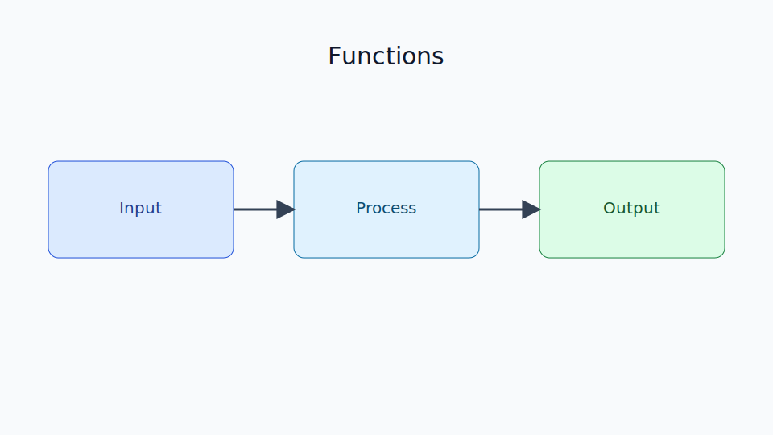

# Functions

Chapter Code: CORE-01-07
Book Code: CORE-01
Version: v0.2.7
Last Updated: 2026-03-08
Status: In Progress
Difficulty: Basic
Estimated Time: 50 menit teori + 45 menit praktik

## Bab Ini Tentang Apa

Bab ini membahas fungsi sebagai cara utama untuk memecah program menjadi bagian kecil yang terstruktur dan dapat digunakan ulang. Kamu akan belajar mendefinisikan fungsi, mengatur parameter, mengembalikan nilai, serta memahami scope variabel dasar.

## Prasyarat Spesifik Bab

- memahami `03_variables_and_names.md`
- memahami `05_operators_and_expressions.md`
- memahami `06_control_flow.md`

## Istilah Kunci

| Istilah | Definisi Singkat | Contoh |
|---|---|---|
| function definition | deklarasi fungsi | `def greet(name): ...` |
| parameter | variabel pada definisi fungsi | `name` pada `def greet(name)` |
| argument | nilai yang dikirim saat memanggil fungsi | `greet("Ayu")` |
| return value | nilai balik dari fungsi | `return total` |
| scope | area akses variabel | local vs global |
| docstring | dokumentasi singkat fungsi | `"""Hitung total."""` |

## Tujuan Besar

Membantu pembaca menulis kode yang modular, lebih mudah diuji, dan tidak duplikasi dengan memanfaatkan fungsi secara benar.

## Tujuan Kecil

- mendefinisikan fungsi dengan `def`
- membedakan parameter dan argument
- menggunakan `return` untuk menghasilkan nilai
- memahami scope lokal dan global dasar
- menulis docstring sederhana

## Peruntukan

Bab ini digunakan saat:

- kode mulai panjang dan berulang
- perlu memisahkan logika ke unit kecil
- ingin membuat program lebih rapi dan reusable

## Bukan Peruntukan

Bab ini bukan untuk:

- konsep advanced seperti decorator kompleks
- optimasi performa pemanggilan fungsi tingkat lanjut

## Analogi

Fungsi seperti resep masak: kamu tulis langkah sekali, lalu bisa dipakai berulang untuk bahan berbeda.

## Miskonsepsi Umum

- Miskonsepsi: fungsi selalu harus mencetak output.
  Klarifikasi: fungsi yang baik sering mengembalikan nilai (`return`) agar bisa dipakai ulang.

- Miskonsepsi: variabel di dalam fungsi otomatis mengubah variabel luar.
  Klarifikasi: variabel lokal tidak langsung mengubah variabel global kecuali ditangani khusus.

## Konsep Inti

### 1. Definisi dan Pemanggilan Fungsi

```python
def greet(name):
    print(f"Halo, {name}!")

greet("Ayu")
greet("Budi")
```

### 2. Parameter, Argument, dan Return

```python
def add(a, b):
    total = a + b
    return total

result = add(10, 5)
print(result)
```

Tanpa `return`, fungsi mengembalikan `None`.

### 3. Default Argument dan Keyword Argument

```python
def power(base, exponent=2):
    return base ** exponent

print(power(3))
print(power(3, 3))
print(power(base=2, exponent=5))
```

### 4. Scope Dasar

```python
x = 100  # global

def show():
    x = 10  # local
    print("local:", x)

show()
print("global:", x)
```

## Diagram



Caption: Diagram menunjukkan alur input argument, pemrosesan di fungsi, dan output melalui return value.

### Legenda Diagram

- kotak biru: input/argument
- kotak tengah: body fungsi
- kotak hijau: return value

## Contoh Kode (Benar)

```python
def calculate_discount(price, discount_percent):
    discount = price * (discount_percent / 100)
    final_price = price - discount
    return final_price

final = calculate_discount(200_000, 10)
print(final)
```

Expected output:

```text
180000.0
```

## Pitfall Umum

Lupa `return`:

```python
def multiply(a, b):
    result = a * b

value = multiply(3, 4)
print(value)
```

Perbaikan:

```python
def multiply(a, b):
    result = a * b
    return result

value = multiply(3, 4)
print(value)
```

Default argument mutable (hindari):

```python
def add_item(item, items=[]):
    items.append(item)
    return items
```

Perbaikan:

```python
def add_item(item, items=None):
    if items is None:
        items = []
    items.append(item)
    return items
```

## Catatan Praktis

- beri nama fungsi dengan kata kerja (`calculate_total`, `validate_email`)
- buat fungsi kecil dengan satu tanggung jawab
- prioritaskan `return` untuk data, gunakan `print` untuk debugging/output pengguna
- tambahkan docstring untuk fungsi publik

## Latihan

### Dasar

Buat fungsi `say_hello(name)` yang mengembalikan salam personal.

### Menengah

Buat fungsi `is_even(number)` yang mengembalikan `True` jika bilangan genap.

### Mini Challenge

Buat kumpulan fungsi kecil untuk kalkulator sederhana: `add`, `subtract`, `multiply`, `divide`, lalu gunakan menu dari bab control flow untuk memilih operasi.

## Checklist Lulus Bab

- [ ] bisa mendefinisikan dan memanggil fungsi
- [ ] memahami parameter vs argument
- [ ] menggunakan `return` dengan benar
- [ ] memahami scope lokal vs global dasar
- [ ] menyelesaikan mini challenge

## Peta Keterkaitan

- Bab sebelumnya: `06_control_flow.md`
- Bab berikutnya: `08_basic_data_structures.md`
- Keterkaitan lintas buku Core: `CORE-04` (Object Model)

## Ringkasan

- Fungsi membantu membangun kode yang modular dan reusable.
- `return` adalah mekanisme utama mengeluarkan hasil fungsi.
- Pemahaman parameter, argument, dan scope mencegah banyak bug dasar.

## FAQ Singkat

1. Kapan fungsi pakai `print` dan kapan `return`?
   Jawaban singkat: gunakan `return` untuk data proses, `print` untuk menampilkan informasi ke pengguna.
2. Apakah boleh fungsi tanpa parameter?
   Jawaban singkat: boleh, jika fungsi tidak membutuhkan input eksternal.
3. Kenapa variabel di fungsi tidak mengubah variabel luar?
   Jawaban singkat: karena variabel dalam fungsi berada di scope lokal.

## Referensi

- Python Tutorial (Defining Functions): https://docs.python.org/3/tutorial/controlflow.html#defining-functions
- Python Language Reference (Function Definitions): https://docs.python.org/3/reference/compound_stmts.html#function-definitions
- PEP 257 (Docstring Conventions): https://peps.python.org/pep-0257/
