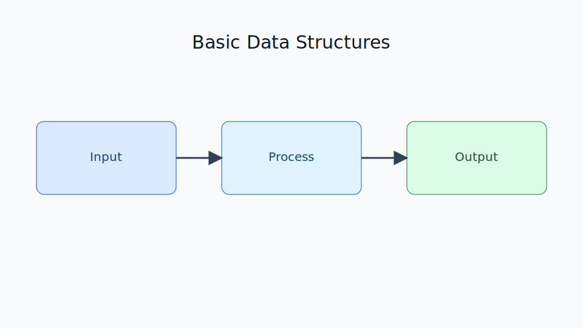

# Basic Data Structures

Chapter Code: CORE-01-08
Book Code: CORE-01
Version: v0.1.0
Last Updated: 2026-03-08
Status: Planned
Difficulty: Basic
Estimated Time: 40 menit teori + 40 menit praktik

## Bab Ini Tentang Apa

Bab ini menjelaskan fondasi basic data structures sebagai bagian awal penguasaan Python secara bertahap.

## Prasyarat Spesifik Bab

- memahami materi pada bab sebelumnya (jika ada)
- mampu menjalankan Python interpreter dan script .py

## Istilah Kunci

| Istilah | Definisi Singkat | Contoh |
|---|---|---|
| syntax | aturan penulisan kode Python | if condition: |
| runtime | lingkungan saat program dijalankan | python main.py |

## Tujuan Besar

Membantu pembaca memahami konsep inti Basic Data Structures agar siap melanjutkan ke bab berikutnya.

## Tujuan Kecil

- mengenali konsep dasar topik bab
- menjalankan contoh kode terkait topik
- menghindari kesalahan dasar yang umum

## Peruntukan

Bab ini digunakan saat:

- memulai pembelajaran Python dari dasar
- membutuhkan referensi konsep inti topik ini

## Bukan Peruntukan

Bab ini bukan untuk:

- pembahasan internal CPython tingkat lanjut
- optimasi performa lanjutan yang spesifik

## Analogi

Anggap topik ini sebagai blok bangunan: tanpa blok ini, struktur program Python akan rapuh.

## Miskonsepsi Umum

- Miskonsepsi: memahami teori saja sudah cukup.
  Klarifikasi: topik ini perlu dipahami lewat praktik kode.

- Miskonsepsi: satu cara menyelesaikan masalah selalu paling benar.
  Klarifikasi: Python menyediakan beberapa pendekatan, pilih sesuai konteks.

## Konsep Inti

### 1. Konsep Dasar

Jelaskan aturan inti dan bentuk dasar penggunaan topik ini dalam Python.

### 2. Penerapan Dasar

Hubungkan konsep dengan contoh sederhana yang sering dijumpai.

## Diagram

Caption: Diagram memberi gambaran besar alur pemahaman bab ini.

### Legenda Diagram

- kotak biru: konsep utama
- panah: alur logika
- kotak hijau: output/hasil

## Contoh Kode (Benar)

`python
print("Belajar Python Basics")
`

Expected output:

`	ext
Belajar Python Basics
`

## Pitfall Umum

Contoh kesalahan yang sering terjadi:

`python
if True
    print("missing colon")
`

Perbaikan:

`python
if True:
    print("colon fixed")
`

## Catatan Praktis

- jalankan contoh kecil lebih dulu sebelum memperbesar kompleksitas
- cek error message Python sebelum melakukan perubahan besar

## Latihan

### Dasar

Tulis ulang contoh kode dan ubah nilai output.

### Menengah

Gabungkan konsep bab ini dengan konsep bab sebelumnya.

### Mini Challenge

Buat script kecil yang menampilkan solusi sederhana berdasarkan topik bab.

## Checklist Lulus Bab

- [ ] memahami konsep inti
- [ ] menjalankan contoh tanpa error
- [ ] memahami pitfall dan perbaikannya
- [ ] menyelesaikan mini challenge

## Peta Keterkaitan

- Bab sebelumnya: $(System.Collections.Hashtable.Prev)
- Bab berikutnya: $(System.Collections.Hashtable.Next)
- Keterkaitan lintas buku Core: $(System.Collections.Hashtable.Link)

## Ringkasan

- topik bab ini adalah fondasi utama Python Basics
- praktik langsung penting untuk menguatkan konsep
- bab ini menyiapkan transisi ke topik berikutnya

## FAQ Singkat

1. Kenapa bab ini penting?
   Jawaban singkat: karena menjadi fondasi untuk bab setelahnya.
2. Apakah harus menguasai semua detail sekaligus?
   Jawaban singkat: tidak, kuasai inti dulu lalu lanjut bertahap.
3. Kapan perlu lanjut ke bab berikutnya?
   Jawaban singkat: setelah checklist lulus bab terpenuhi.

## Referensi

- Python Official Documentation: https://docs.python.org/3/
- Python Language Reference: https://docs.python.org/3/reference/
- Python Tutorial: https://docs.python.org/3/tutorial/
