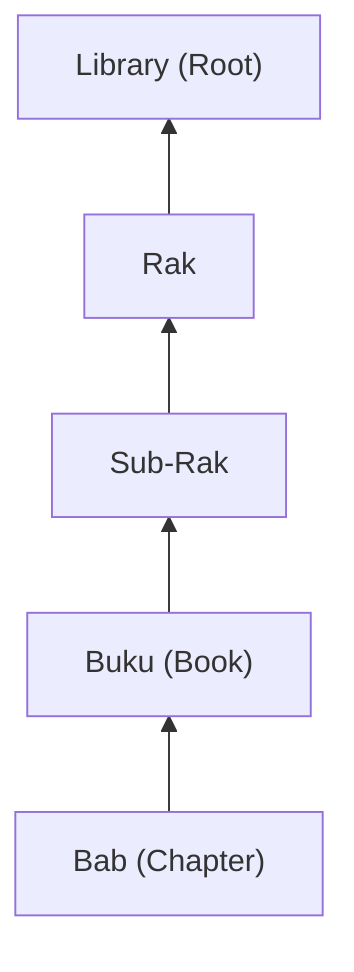

# Protokol Pembaruan Status (Universal Edition)

Progress pengerjaan proyek Knowledge Base dihitung secara otomatis (bubbling up) dari unit terkecil untuk memastikan akurasi data yang mencerminkan realitas.

## 1. Level Bab (Chapter)
Status dicatat di `docs/status.md` pada level **Buku**.
- `Draft`: Narasi sedang ditulis (PPM Stage 1-2).
- `Partial`: Kode atau Diagram belum lengkap (PPM Stage 3-4).
- `Sync`: Mencapai Gold Standard (Verified).

## 2. Level Buku
Setiap Buku wajib memiliki `docs/status.md` yang merangkum progress seluruh Bab di dalamnya.
- **Format**: `(Σ Bab Sync) / (Total Bab)`.
- **Target**: Mencetak persentase penyelesaian untuk dilaporkan ke level atas.

## 3. Level Rak & Global
Setiap kali Buku naik % progressnya, data tersebut dilaporkan secara bertahap ke:
1. `RAK-XX/README.md` (Progress Rak)
2. `docs/README.md` (Global Status Table)

---

## Mekanisme "Bubbling Up"

Setiap perubahan di dasar (Bab) harus "menguap" hingga mengubah angka di tingkat tertinggi (Root). Ini menjamin keterbukaan informasi bagi seluruh pengembang.

---
*Peringatan: Dokumentasi dianggap "Published" hanya jika statusnya `Sync`.*
